# 计算机组成需体系结构
- 重点 2 4 6
# 202004
- 26.1 最小阶值
- 26.2 最大阶值
- 26.3 阶的个数
- 26.4 最小尾数值
- 26.5 最大尾数值
- 26.6 可表示的最小值
- 26.7 可表示的最大值
- 26.8 可表示数的个数
  - 第 2 章 数据表示、寻址方式与指令系统
- 27.1 设计合理算法，使得完成计算时间最少
- 27.2 画出流水线完成该计算的时空图，并求出计算时间
  - 第 5 章 流水和指令级高度并行的超级机
- 28.1 求中断处理次序
- 28.2 画出程序过程示意图
  - 第 3 章 存储、中断、总线与 I/O 系统
- 29.1 利用fork、join 语句将其改成可在多处理机上并行执行的程序
- 29.2 画出程序在两台处理机上执行的时间关系图
  - 第 7 章 多处理机

# 202010
- 26.1 计算该存储系统每MB的平均价格
- 26.2 计算Cache命中率
- 26.3 该存储系统的平均访问时间
- 26.3 该存储系统的访问效率
  - 第 4 章 存储体系
- 27.1 写出所有单级PM2I互连函数一般式
- 27.2 传送到哪些处理单元上
- 27.3 两个处理单元的最大距离是多少
  - 第 6 章 阵列处理机
- 28.1 利用fork、join 语句将其改成可在多处理机上并行执行的程序
- 28.2 画出程序在两台处理机上执行的时间关系图
  - 第 7 章 多处理机
- 29.1 写出延迟禁止表F，冲突向量C
- 29.2 画出流水线状态转移图
- 29.3 求出最佳调度方案、最小平均延迟
  - 第 5 章 流水和指令级高度并行的超级机
    
## 202104
- 26.1 画出处理过程时空图
- 26.2 该流水线的实际吞吐率和效率
  - 第 5 章 流水和指令级高度并行的超级机
- 27.1 写出实现此功能的互连函数的一般式
- 27.2 画出三级立方体网络实现该互连函数的拓扑结构图，标出各级控制开关的状态
  - 第 6 章 阵列处理机
- 28.1 构造哈夫曼树，计算采用哈夫曼编码时平均码长
- 28.2 给出一种最优编码方案，使得操作码的平均码长最短，并求出平均码长
  - 第 2 章 数据表示、寻址方式与指令系统
- 29.1 设计各级中断处理程序的中断级屏蔽位置
- 29.2 画出程序运行过程示意图
  - 第 3 章 存储、中断、总线与 I/O 系统

## 202110
- 26.1 画出LRU替换算法，Cache内各块的实际替换过程图，并标出命中时刻
- 26.2 求出此区间的命中的Cache命中率
  - 第 4 章 存储体系
- 27.1 画出流入四个任务的时空图
- 27.2 计算流入50个任务的实际吞吐率和效率
- 27.3 计算改进后的流入50个任务的实际吞吐率
  - 第 5 章 流水和指令级高度并行的超级机
- 28.1 若用字节多路通道，通道最高流量是多少
- 28.2 不少于四台设备挂在此通道上，最好多挂一些，且高速设备尽量多挂，应该选择那些设备挂载，为什么？
- 28.3 若用数组路通道，通道最高流量是多少 设256B
- 28.4 应该选择那些设备挂载，为什么？
  - 第 3 章 存储、中断、总线与 I/O 系统
- 29.1 分析程序语句并行性，并用fork、join、goto语句改成多处理机上并行执行的程序
- 29.2 画出程序在两台处理机上执行的时间资源图
  - 第 7 章 多处理机

## 202204
- 26   分别求出用等长码、哈夫曼码、只有两种码长的扩展操作码三种编码方式的操作码的平均码长
  - 第 2 章 数据表示、寻址方式与指令系统
- 27   请用虚线标出各开关的控制状态。如果是staran网络，上述五对单元是否可以同时传送？为什么？
  - 第 6 章 阵列处理机
- 28.1 设计各级中断处理程序的中断级屏蔽位置
- 28.2 请画出机器运行程序时全过程示意图
  - 第 3 章 存储、中断、总线与 I/O 系统
- 29.1 请画出并行算法的树形流程图，并确定处理机数P和树高Tp
- 29.2 用fork、join、goto语句写出运算表达式的多处理机并行程序段 
  - 第 7 章 多处理机

## 202210
- 26.1 用堆栈对该页地址流模拟一次，画出此模拟过程，并标出实业数为3，4，5时的命中情况
- 26.2 为获得最高命中率，至少应分配给该程序几个实页？其可能的最高命中率是多少？
  - 第 4 章 存储体系
- 27.1 哪些可以并行，哪些可以链接执行？
- 27.2 计算向量指令执行完成所需的最小拍数
  - 第 5 章 流水和指令级高度并行的超级机
- 28.1 根据使用频度，设计出全哈夫曼操作码，并计算其平均码长
- 28.2 设计优化实用的操作码形式，并计算其操作码的平均长度
  - 第 2 章 数据表示、寻址方式与指令系统
- 29.1 写出延迟禁止表，冲突向量
- 29.2 画出流水线状态转移图
- 29.3 求出最小平均间隔拍数及最佳调度方案
  - 第 5 章 流水和指令级高度并行的超级机

## 202304
- 26   设计各级中断处理程序的中断级屏蔽位置
  - 第 3 章 存储、中断、总线与 I/O 系统
- 27.1 分别求出各通道应具有多大设计流量，才不丢失数据
- 27.2 设I/O系统流量占主存流量1/3时才算流量平衡，则主存流量应该达到多少
  - 第 3 章 存储、中断、总线与 I/O 系统
- 28.1 写出延迟禁止表F，冲突向量C
- 28.2 画出流水线状态转移图
- 28.3 求出最佳调度方案、最小平均延迟及流水线最的最大吞吐率
  - 第 5 章 流水和指令级高度并行的超级机
- 29   使用fork join语句表示其并行任务的派生和汇合关系的程序，以假想此程序能在多处理机上运行
  - 第 7 章 多处理机

## 二.1.浮点数尾数基值
```
设某机器阶值 6 位、尾数 48 位，阶符和数符不在其内，当尾数分别以 2、8、16 为基时，在非负阶、正尾数、规格化情况下
，求出其最小阶、最大阶、阶的个数、最小尾数值、最大尾数值、可表示的最小值和最大值及可表示数的个数。
p=6 m=48 在非负阶、正尾数、规格化情况下: r = 2、8、16 
                                              2             8          16
m`           = m/(log2^r) =                 48/1          48/3       48/4
最小介值      =  0
最大介值      = 2^p-1 =63   
阶的个数      = 2^p   =64
最小尾数值    = 1/r   =                        1/2           1/8        1/16
最大尾数值    = 1-(r^-m`) =                  1-(2^-48)     1-(8^-16)  1-(16^-12)
可表示的最小值 = 最小尾数值
可表示的最大值 = r^r的最大阶值*最大尾数值        2^63*( 1-(2^-48))
可表示数的个数 = 阶的个数 *( r^m` )* (r-1/r)  64* 2^48*(1/2)= 2^6 * 2^48 * 2^-1 = 2^53
                                          64* 8^16*(1/8)=2^6 * 8^16 * (7/8) =7/8*2^54=7*2^51      
        
```
## 二.2.ROM表（NOT）
```
由 4 位数（其中最低位为下溢处理的附加位）经 ROM 查表舍入法，下溢处理成 3 位结果，设计下溢处理平均误差接近于 0 的 ROM 表
，列出 ROM 编码表的地址与内容的对应关系。

（4 位数）从0000 到 1111 四舍五入成3位（下溢处理成 3 位）： 0000->000,0001->001...1110->111,1111->111
```
## 二.3.哈夫曼码
```
经统计，某机器 14 条指令的使用频度分别为：0.01，0.15，0.12，0.03，0.02，0.04，0.02，0.04，0.01，0.13，0.15，0.14，0.11，0.03。
分别求出用【等长码】、【哈夫曼码】、【只有两种码长的扩展操作码】等 3 种编码方式的操作码平均码长。

平均码长：
等长码 = log2^14 = 4
哈夫曼码=  6*0.02 + 5*0.1 + 3*0.12 + 5*0.04 + 4*0.04  + 3*0.68= 0.12 + 0.5 + 0.36 + 0.2 + 0.16 + 2.04= 3.38
---------哈夫曼树 排序相加----------
0.01，0.01，0.02，0.02，0.03，0.03，0.04，0.04，0.11，0.12，0.13，0.14，0.15，0.15
    |  |      |    |     |     |    |    |    |     |     |    |     |     |
    0.02      0.04 ------|----- 0.07----0.08  |     |      0.27        0.3
     |------------------0.05      |      |    |     |        |          |
                           |      |        0.19     |           0.57
                             0.12            |      |            |
                               |             |      |            |
                                      0.24   |                   |
                                        |    |                   |   
                                          0.43                   |
                                            |                    | 
                                                    1
---------哈夫曼树 转换----------
                                                             1
                                          0.43                                                  0.57 
                              0.24                           0.19                      0.27                 0.3
                  0.12                  0.12         0.08              0.11         0.13 0.14            0.15 0.15
           0.05             0.07                 0.04      0.04 
      0.02      0.03     0.03 0.04            0.02 0.02
    0.01 0.01    
码长  6    6      5        5    5         3      5   5       4             3          3      3               3     3
---------哈夫曼树 结束----------
只有两种码长的扩展操作码？ 通过哈夫曼树知道 码长{六个3, 一个4,  五个5,  两个6}
如果只选两种码长的组合 {六个3, 八个5}

本题就是在 4 种码长的哈夫曼码上转化成两种码长的扩展操作码。先观察哈夫曼码，14 条指令中 6 条码长是 3，3 位二进制表示数有 8 个
，那么就会剩下 2 个作为长码的前缀；剩下还有 8 条指令，那么后缀就要能表示 4 个数，那么后缀用 2 位就可以了。
所以本题就是 6 个频度高的码长为 3，8 个频度低的码长用 5。平均码长是一样算的，结果是 3.4。

平均码长= 5*0.02 + 5*0.1 + 3*0.12 + 5*0.04 + 5*0.04  + 3*0.68= 0.1 + 0.5 + 0.36 + 0.2 + 0.2 + 2.04= 3.4

```

## 三.1.并行主存系统(NOT)
```
1.(最大频宽)设主存每个分体的存取周期为2μs，宽度为4个字节。采用模m多分体交叉存取，但实际频宽只能达到最大频宽的 0.6 倍。
现要求主存实际频宽为4MB/S，问主存模数m应取多少方能使两者速度基本适配（m取 2 的幂）？

解：
最大频宽 Bm = W * m/Tm =4 * m/2 
0.6 × Bm ≥ 4
m≥4 求得 m ≥ 3.33，因为m要取2的幂所以 m=4

存取周期 Tm：每个分体存取一次数据的时间
宽度 W：存储体字长，每个分体一次存取多少数据
模 m：并行工作的存储体数，分体的数量
频宽 B：存取数据的速度


2.(平均字数)程序存放在模 32 单字交叉存储器中，设访存申请队的转移概率 λ 为 25%，
求每个存储周期能访问到的平均字数。当模数为 16 呢？由此可得到什么结论？
解： 记公式
B = (1−(1−λ)^m)/λ = (1−(1−0.25)^32)/0.25 ≈4
m=16, B = (1−(1−0.25)^16)/0.25 ≈3.96
可以看出两者非常接近，也就是说提高模数对提高主存实际频宽效果不显著。
实际上模数进一步增大会因为工程实现上的问题，导致性能反而下降，且价格更高。所以模数不宜太大，

```

## 三.2.中断屏蔽位、程序运行图
```
若机器共有5级中断，中断响应优先次序为 1 → 2 → 3 → 4 → 5，现要求其实际的中断处理次序为 1 → 4 → 5 → 2 → 3，回答下面问题：
（1）设计各级中断处理程序的中断级屏蔽位（令“1”对应于屏蔽，“0”对应于开放）；
（2）若在运行用户程序时，同时出现第 4、2 级中断请求，而在处理第 2 级中断未完成时，又同时出现第 1、3、5 级中断请求，请画出此程序运行过程示意图。

*屏蔽位对应的就是程序级别（屏蔽位表示不可被打断）
------------中断级屏蔽位--------------
程序级别 | 1   2  3  4  5   
  1     | 1   1  1  1  1 -> 按照  1 → 4 → 5 → 2 → 3 终端处理次序，1的级别最高，没有任何程序可以打断
  2     | 0   1  1  0  0
  3     | 0   0  1  0  0 -> 按照  1 → 4 → 5 → 2 → 3 终端处理次序，3的级别最低，除自己外都可以打断
  4     | 0   1  1  1  1
  5     | 0   1  1  0  1
  
程序运行过程示意图： + 代表交换程序状态字的时间，理解为切换到中断处理程序（+号在实际画图总是短横线不可省略）
                  ---------中断处理程序--------
中断请求 用户程序    1     2     3     4     5
          |
2，4-----> ——————————————|
                         ————————————+
                                     | 
                                     | 
                                     |
                         +————————————    
1，3，5---------> +——————       
                 |
                 |
                 |———————
                         —————————————————+
                                          |
                                          |
                        +—————————————————|
          |—————————————|                 
          ——————————————————+
                            |
                            |
          ——————————————————|
          +
          |
          V                          
```

## 三.3.通道流量设计
```
1.有 8 台外设，各设备要求传送信息的工作速率分别如下表所示。现设计的通道在数据传送期，每选择一次设备需 2μs，每传送一个字节数据也需要 2μs。
（1）若用作字节多路通道，通道工作的最高流量是多少？
（2）作字节多路通道用时，希望同时不少于 4 台设备挂在此通道上，最好多挂一些，且高速设备尽量多挂一些，请问应选哪些设备挂在此通道上？为什么？
（3）若用作数组多路通道，通道工作的最高流量是多少？设定长块大小取成 512 B。
（4）作数组多路通道用时，应选哪些设备挂在此通道上？为什么？
---------------------------------------------
设备	工作速率/(KB/s) 	设备工  作速率/(KB/s)
A	 500	          E	      50
B	 240	          F	      40
C	 100	          G	      14
D	 75 	          H	      10
---------------------------------------------
相关概念：
-----------------------------------------------------------------
              数据宽度	数据传输方式	通道极限流量	   实际最大流量
字节多路通道	  1个字节	  字节交叉	1/（Ts+Td）   各个设备的速率和
数组多路通道	   定长块	  成组交叉	K/(Ts+K*Td)    速率最大的设备
选择通道	      可变长块	            N/(Ts+N*Td)    速率最大的设备
-----------------------------------------------------------------
数据宽度：代表通道每次传送多少数据后重新选择一次设备；
字节多路通道：每传输一个字节就要重新选择设备；
数组多路通道：每传输一个定长块大小的数据重新选择设备，定长块就是固定 K 个字节；
选择通道：每次把一个设备需要的数据传完再重新选设备，因为每个设备需要的数据是不一样的所以是可变长块，如一个设备需要传 N 个字节的数据。

Ts：通道选择一次设备需要的时间；
Td：通道传送一个字节需要的时间；对应题目给出的两个时间。

1） 1/(2+2) = 0.25 B/μs ,答案给出的是 250 KB/s，直接按 1000 倍而不是 1024 倍换算。
2) C D E G H, 加起来港号249KB/s
3) 512/(2 + 512*2) = 499 KB/s
4) 数组多路通道只要 速率最大的设备 不超过通道 极限流量即可，除了 A 都能挂


2.如果通道在数据传送期间，选择设备需9.8μs，传送一个字节数据需0.2μs。某低速设备每隔500μs，发出一个字节数据传送请求，
1）问至多可连接几台这种低速设备？
2）对于如下A∼F 6种高速设备，一次通信传送的字节数不少于 1024 个字节，问哪些设备可以挂在此通道上？哪些则不能？
其中A∼F 设备每发送一个字节数据传送请求的时间间隔如下表所示。
---------------------------------------------
设备  	发送申请间隔μs	   设备	发送申请间隔μs
A	      0.2             	D	  0.19
B	      0.25              E	  0.4
C	      0.5             	F	  0.21
---------------------------------------------

1）低速设备每隔500μs发出一个字节数据传送请求；题目里虽然没有说通道是什么通道，但是这里明显只能是字节多路通道，传送一个字节需要10μs，所以最多可以连 50 台。
2）一次通信传送的字节数不少于 1024 个字节，很显然这里是数组多路通道： 1024/(9.8 + 0.2*1024) = 1/(9.8/1024 +0.2) B/μs
表格中给出的是设备发送一个字节数据传送请求的时间间隔，1/时间间隔=速率，而数组多路通道设备的最大速率不超过极限流量即可
，也就是表格中的时间间隔要大于极限流量的分母，即要大于 0.2，显然只能挂 BCEF 4 个设备。
```

## 四.1.页表法地址映像（NOT）
```
某虚拟存储器共 8 个页面，每页 1024 个字，实际主存为 4096 个字，采用页表法进行地址映像。映像表内容如下。
（1）列出会发生页面失效的全部虚页号；
（2）按以下虚地址计算主存实地址：0，3728，1023，1024，2055，7800，4096，6800。
-------------
实页号	装入位
3	      1
1	      1
2	      0
3	      0
2	      1
1	      0
0	      1
0	      0
-------------
```
## 四.2.页面替换算法：FIFO、LRU
```
1.有一个虚拟存储器，主存有 0~3 四页位置，程序有 0~7 八个虚页，采用全相连映像和 FIFO 替换算法。给出如下程序页地址流：2, 3, 5, 2, 4, 0, 1, 2, 4, 6。
（1）假设程序的 2, 3, 5 页已先后装入主存的第 3, 2, 0 页位置，请画出上述页地址流工作过程中，主存各页位置上所装程序各页页号的变化过程图，标出命中时刻；
（2）求出此期间虚存总的命中率 H。
【页面替换理解：
主存有 4 页空间，程序有 8 种页号，这里把页号当做一条指令，如果主存中有需要运行的指令，就代表了命中；
而主存中没有就需要把这个指令存到主存中的空位里，如果已经没有空位了就要替换掉已经存在里面的指令。替换算法就是为了提高命中率，相当于提高效率。
简单介绍一下不同的页面替换算法：
（1）随机算法（Random，RAND）：生成随机数选择被替换的页号，不考；
（2）先进先出算法（First-In First-Out，FIFO）：最早装入主存的页作为被替换页；
（3）近期最少使用算法（Least Recently Used，LRU）：近期最少访问的页作为被替换页；
（4）优化替换算法（Optimal，OPT）：一种理想化的算法，它是根据程序未来的地址流来选择替换哪一页的，选择未来最晚被用到的页被替换，
举个例子：现在主存里面存了 1, 2, 3, 4 而且存满了，后面来的地址流是 1, 1, 5, 3, 4, 6, 1
，根据未来的地址流 2 是最晚被用到的（这里是未来直接不用了），因此要发生替换时优先替换 2。
这种替换方式可以让命中率最大化，用来评价其它可实现的替换算法的好坏。】
1）过程图
------------------------------------------------------------
主存页   初始            页地址流
面位置	状态	   2  3 5 2 4   0   1   2   4   6
0	      5	|  5  5 5 5 5   5   5*  2   2   2
1			|           4   4   4   4*  4*  6
2	      3	|  3  3 3 3 3   3*  1   1   1   1
3	      2	|  2  2 2 2 2*  0   0   0   0   0
命中         | H  H	H H					H	
------------------------------------------------------------
2）命中率就是 10 个地址命中了 5 次 H = 5/10 = 50 %

2.考虑一个 920 个字的程序，其访问虚存的地址流为 20, 22, 208, 214, 146, 618, 370, 490, 492, 868, 916, 728。
（1）若页面大小为 200 字，主存容量为 400 字，采用 FIFO 替换算法，请按访存的各个时刻，写出其虚页地址流，计算主存的命中率；
（2）若页面大小改为 100 字，再做一遍；
（3）若页面大小改为 400 字，再做一遍；
（4）由前三问的结果可得出什么结论？
（5）若把主存容量增加到 800 字，按第（1）小题再做一遍，又可以得到什么结论？
--------------------------------------------------------------------
本题的区别在于题目给出的是 虚存的地址流 和 页面大小，而不是 4-7 中的 程序页地址流。
这里把虚存的地址流看作虚地址，程序页地址流看作虚页号，按照 4-4 中的公式，虚地址除以页面大小的商就是虚页号。
主存容量除以页面大小就是 4-7 中的主存空间页数。

这里把 1、2、3、5 的结果画在一起：


4）从前三问的结果可以看出，在分配给程序的实存容量一定（400 字）的条件下，页面大小 Sp 过小时，命中率 H 较低；
页面大小增大后，两个地址在同页内的机会增大，使命中率 H有所上升；由于指令之间因远距离的跳转引起命中率 H下降的因素不起主要作用
，还未出现随页面大小增大，而使命中率 H下降的情况。如果页地址流有大量的远距离转移，随页面大小增大，因在主存中的页面数过少
，而导致出现虚存页面被轮流替换出去的 “颠簸” 现象时，命中率 H反而会下降。

5）可以看出，分配给程序的实存容量增大后，命中率将会有所上升。不过，命中率的提高已不显著了。如果在增大容量，可以推断出命中率的上升就会渐趋平缓了。
```

##  四.3.页面替换算法：堆栈模拟
```
采用 LRU 替换算法的页式虚拟存储器共有 9 页空间准备分配给 A、B 两道程序。已知 B 道程序若给其分配 4 页时
，命中率为 8/15；而若分配 5 页时，命中率可达 10/15。现给出 A 道程序的页地址流的 2, 3, 2, 1, 5, 2, 4, 5, 3, 2, 5, 2, 1, 4, 5。
（1）画出用堆栈对 A 道程序页地址流的模拟处理过程图，统计给其分配 4 页和 5 页时的命中率；
（2）根据已知条件和上述统计结果，给 A、B 两道程序各分配多少实页，可使系统效率最高？

堆栈模拟其实是模拟的压栈过程，个人把它类比成堆叠书籍，如下表：
2 先放桌上，3 来了叠在 2 上面，2 又来了就抽出来放在 3 上面，后面都是一样的过程。
n=4 的时候就是只看堆栈内容的前 4 行，最后一行的代表被替代了，这也就符合 LRU 的规则，因为如果最近被用到过肯定是叠在上面的，最下面的就被替代了。
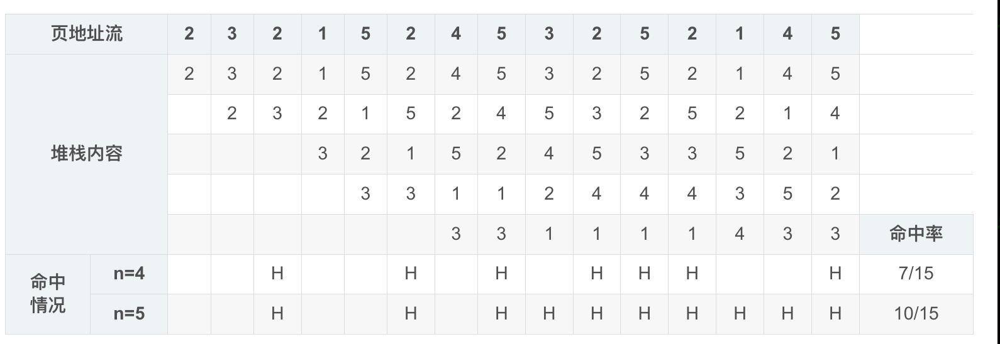

2）因为一共就 9 页这里的分配方法就是 A4 B5 或者 A5 B4 两种，A 的命中率算出来了，B 的命中率是题目给的
，那么 A4 B5 的命中率是 (7/15+10/15)/2=8.5/15，A5 B4 的命中率是 (10/15+8/15)/2=9/15，后面一种系统效率高。

```

##  四.4.Cache 组相联映像
```
有一个 Cache 存储器。主存共分 8 个块 (0~7)，Cache 为 4 个块 (0~3)，采用组相联映像，组内块数为 2 块，替换算法为 LRU。
（1）画出主存、Cache 地址的各字段对应关系图（标出位数）；
（2）画出主存、Cache 空间块的映像对应关系示意图；
（3）对于如下主存块地址流：1, 2, 4, 1, 3, 7, 0, 1, 2, 5, 4, 6, 4, 7, 2，如主存中内容一开始未装入 Cache 中，请列出 Cache 中各块随时间的使用状况；
（4）对于（3），指出块失效又发生块争用的时刻；
（5）对于（3），求出此期间 Cache 之命中率。

相关概念：
之前页面替换算法的题目是把 虚存 的地址存到 主存 时发生替换，这里是把 主存 的地址存到 高速缓存 Cache 时发生替换，替换方法并没有区别，
但是地址映像之前是 全相连映像，这里是 组相联映像。

全相连映像：主存中任意一块都可映像装入到 Cache 中任意一块位置；就像之前的题目一样，每个虚地址都可以存到主存的任意一页中，没有限制。
直接映像：主存空间按 Cache 大小等分成区，每个区内的个块只能按位置一一对应到 Cache 的相应块位置上；
举例说明比较直接：主存有 0~7 共 8 个块，Cache 有 0~3 共4 个块，那么主存的 0、4 只能存到 Cache 的 0：
(0,4)→0
(1,5)→1
(2,6)→2
(3,7)→3
组相联映像：Cache 分成若干组，主存按 Cache 分区，每个区也按 Cache 的样子分组，然后组和组之间直接映像，组和组内部的块相联映像；具体看本题答案可以直观理解。

2）先看第二问
Cache 4 块，每组 2 块 即分成 2 组；主存 8 块，即 2 区 2 组 2 块。组间直接映像，即 0 组对应 0 组，1 组对应 1 组；组内相联映像，即组内块和块可以随意存放。
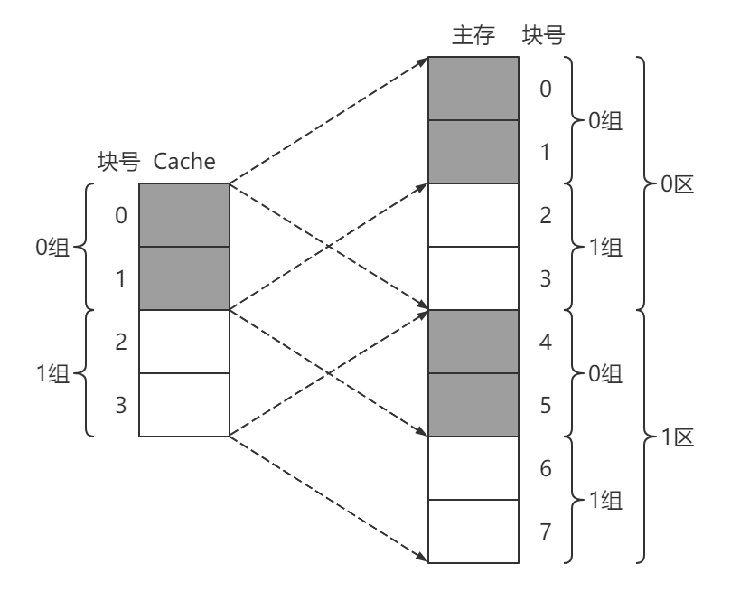

1）各字段对应关系图
根据（2）的结果，可以知道主存是 2 区 2 组 2 块，所以都用 1 个二进制位就能表示；Cache 就是比主存少个区号，别的都一样。有些题目还会给出每块的大小，可以标出块内地址的位数。
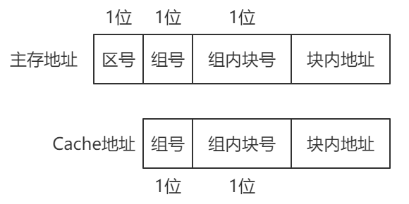

3)根据映像关系 Cache 的 0, 1 只能存主存的 0, 1, 4, 5；Cache 的 2, 3 只能存主存的 2, 3, 6, 7；然后就和页面替换算法的题一样了。
这里就用到 LRU 替换算法了，近期最少访问的页作为被替换页；见表格 t=3 时，4 进来 0 组存满了，此时 4 刚用过
，1 为最久没用过的所以 1 标记星号，当 t=4 时，又用到了 1，所以改为 4 标记星号。
-------------------------------------------------------------------------------
时间t	        1	2	3	4	5	6	7	8	9	10	11	12	13	14	15
主存块地址	    1	2	4	1	3	7	0	1	2	5	4	6	4	7	2
-------------------------------------------------------------------------------
Cache 块	0	1	1	1*	1	1	1	1*	1	1	1*	4	4	4	4	4
            1			4	4*	4*	4*	0	0*	0*	5	5*	5*	5*	5*	5*
            2		2	2	2	2*	7	7	7	7*	7*	7*	6	6	6*	2
            3					3	3*	3*	3*	2	2	2	2*	2*	7	7*
-------------------------------------------------------------------------------
命中情况	        失	失	失	H	失	替	替	H	替	替	替	替	H	替	替
-------------------------------------------------------------------------------

4）块失效又发生块争用的时刻：6, 7, 9, 10, 11, 12, 14, 15（发生替换的时刻）
5）命中率：Hc = 3/15 = 0.2
```

## 四.5.Cache 存储体系性能参数
```
有一个由 Cache 和主存组成的两级存储系统：主存的容量为 100MB，访问时间为 200ns，主存每 MB 的价格为 1 元；
Cache 的容量为 4MB，访问时间为 10ns，Cache 每 MB 的价格为 50元。
该系统运行某程序，在一段时间内，访问 Cache 的次数为 1980 次，访问主存的次数为 20 次。要求：
（1）计算该存储系统每 MB 的平均价格。
（2）计算系统运行该程序时 Cache 的命中率。
（3）计算该存储系统的平均访问时间。
（4）计算该存储系统的访问效率。

1）(100×1+4×50)/(100+4)≈2.88
2) (1980+20)/1980=99%
3) (20×200+1980×10)/2000=11.9 ns
- 标准公式是 Ta = H*Tc + ( 1 − H )Tm ，有时题目会给命中率（访问 Cache 代表命中），也要会用这个公式算，原理是一样的。
4)访问效率 e = Tc / Ta = 10 / 11.9 ≈ 84 % 
- 稍微记一下公式，其实 Tc 也就意味着全部命中的平均时间，也就是最理想的时间，用他除以实际的平均时间自然可以代表效率；
- 有的题是算关于加速比的 s = Tm / Ta，也就是最慢时间除以实际平均时间。
```


## 五.1.重叠
```
假设指令的解释分取指、分析和执行 3 步，每步的时间相应为 t取指、t分析、t执行
（1）分别计算下列几种情况下，执行完 100 条指令所需时间的一般关系式：
① 顺序方式；
② 仅 “执行k” 与 “取指k+1” 重叠；
③ 仅 “执行k”、“分析k+1” 与 “取指k+2” 重叠；
（2）分别在 t取指 = t分析 =2、t执行=1 和 t取指 = t执行 = 5、t分析=2两种情况下，计算出上述各结果。
1）一般关系式
① 顺序执行
    100 × (t取指 + t分析 + t执行)
顺序执行顾名思义按顺序处理完一个处理下一个
② 仅 “执行k” 与 “取指k+1” 重叠；
    也就是上一个的执行和下一个取指可以同时进行，画一下图便于计算
  ---------------------------------------------------- 
      取指k	分析k	执行k				
                    取指k+1	分析k+1	执行k+1		
                                    取指k+2	分析k+2	执行k+2 
  ----------------------------------------------------  
t取指 + 100×t分析 + 99×max{t取指 , t执行} + t执行
第一个取指就是取指时间，后面 99 个取指会和之前的执行重叠取最大值，最后一个的执行就是执行时间，分析没有重叠就是 100 个分析时间。
③仅 “执行k”、“分析k+1” 与 “取指k+2” 重叠；
  _____________________________________________________
  取指k	分析k	执行k		
        取指k+1	分析k+1	执行k+1	
                取指k+2	分析k+2	执行k+2
  _____________________________________________________
t取指+max{t分析 , t取指} + 98×max{t取指 , t分析 , t执行} + max{t执行 , t分析} + t执行
2）有了公式代进去算就行了
t取指=t分析=2、t执行=1
① 100 × ( 2 + 2 + 1 ) = 500 
② 2 + 100 × 2 + 99 × 2 + 1 = 401
③ 2 + 2 + 98 × 2 + 2 + 1 = 203
t取指=t执行=5、t分析=2
① 100 × ( 5 + 5 + 2 ) = 1200
② 5 + 100 × 2 + 99 × 5 + 5 = 705
③ 5 + 5 + 98 × 5 + 5 + 5 = 510
```

## 五.2.流水线-时空图
```
有一个浮点乘流水线如图（a）所示，其乘积可直接返回输入端或暂存于相应缓冲寄存器中
，画出实现A×B×C×D 的时—空图以及输入端的变化，并求出流水线的吞吐率和效率；
当流水线改为图（b）所示的形式实现同一计算时，求该流水线的效率及吞吐率。
图（a）
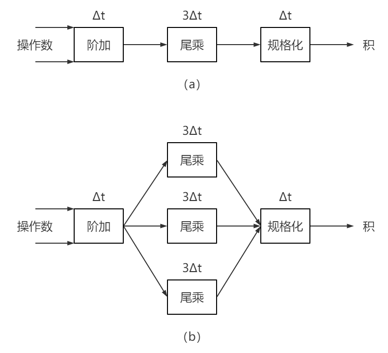
图（b）


（a）吞吐率 Tp = 3/13Δt，效率η = 3×5/(3×13)= 5/13
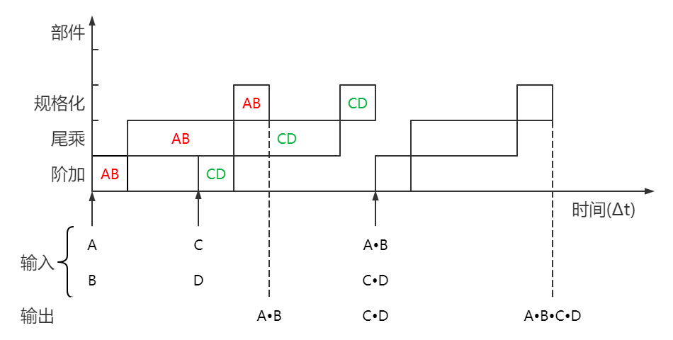
解释：
题目中给出的浮点乘流水线代表了要完成一次乘法，需要经过 3 个步骤，这三个步骤需要按顺序分别在不同的部件上执行，如图中红色标记的 AB。
实现A×B×C×D，可以让A×B 与 C×D 并行，最后将两项相乘。
画图的时候建议在分析完式子的并行性和处理步骤后，先画一个计算步骤，如图中三个标红的 AB，可以发现第二个步骤尾乘需要的时间最长
，就在后面直接画下个并行的运算的第二个 步骤，即 CD 的尾乘，然后再添上 CD 剩余的步骤。
  吞吐率 = 流水线输出的个数 / 消耗时间
  效率 = 图像中方块的面积 /(消耗时间×部件个数) 
（b）吞吐率 Tp = 3/11Δt，效率η = 3×5/(5×11)= 3/11
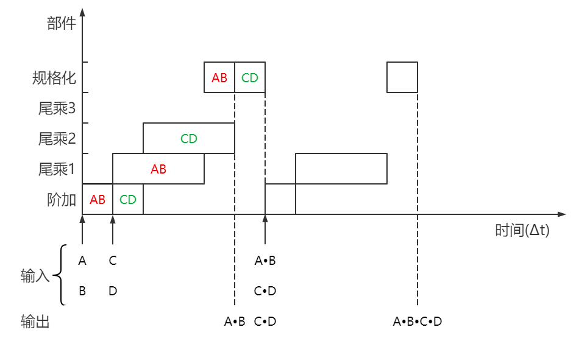
（b）图代表有三个部件可以并行处理尾乘
```

## 五.2.流水线-瓶颈消除方法
```
为提高流水线效率可采用哪两种主要途径来克服速度瓶颈？现有 3 段流水线，各段经过时间依次为Δt、3Δt、Δt。
（1）分别计算在连续输入 3 条指令时和 30 条指令时的吞吐率和效率。
（2）按两种途径之一进行改进，画出流水线结构示意图，同时计算连续输入 3 条指令和 30 条指令时的吞吐率和效率。
（3）通过对 (1)、(2) 两小题的计算比较可得出什么结论？

1）此题中的 3 条和 30 条指令都是可以并行的，类似 五.2.流水线-时空图 中 AB 和 CD 的并行。
答案中按照公式计算：n为指令条数，m为流水线段数，Δti 为每一段对应的时间，Δtj = 3Δti
        m                            m                m
Tp= n/( ∑  * Δti +(n−1)Δtj  ) , η= n ∑  * Δti  /  (m[ ∑ * Δti + (n−1)Δtj ])
       i=1                          i=1              i=1 
n=3时， Tp=3 /( ((1+3+1)+  2∗3)Δt ) = 3/11Δt,  η= 3∗5 /3∗11 = 5/11
n=30时，Tp=30/( ((1+3+1)+ 29∗3)Δt ) = 15/46Δt, η= 30∗5/3∗92 = 25/46

2）观察时空图就可以发现瓶颈在于时间较长的段，解决瓶颈有两种方式：
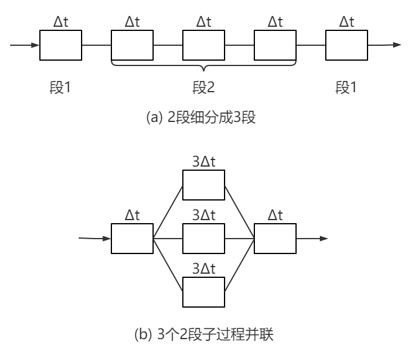
a）瓶颈子过程再细分：把第二段再分为 3 段，每段 Δt 且各自有部件来处理，这样就能让每个步骤紧凑了。

b）瓶颈子过程并联：添加几个部件实现并行处理第二段，这样每条指令就不需要等上一条指令处理完把部件空出来再处理了。
两种方法的吞吐率和效率是一样的：
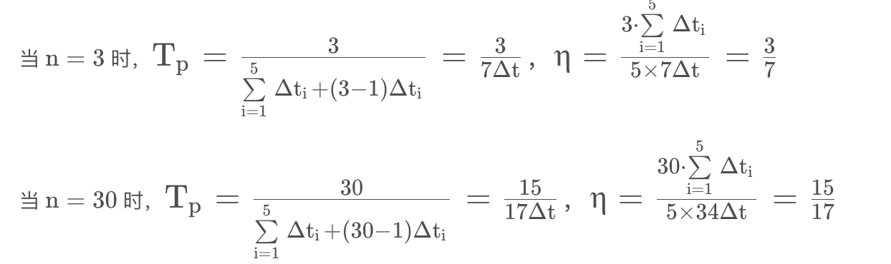

3）通过对不同的指令条数比较可以看出，指令越多流水线的实际吞吐率和效率才会提高。通过对前两问的结果比较
，可以发现两种消除瓶颈的途径都是在指令越多的时候实际吞吐率和效率才会显著提高，如果指令太少虽然可以提高实际吞吐率
，但效率反而会降低（因为虽然时间降低了，但是段数也增加了）。
```

## 五.3.流水预约表
```
在一个 5 段流水线处理机上需经 9 拍才能完成一个任务，其预约表如下表所示。
(1)分别写出延迟禁止表 F、冲突向量 C；
(2)画出流水线状态转移图；
(3)求出最小平均延迟及流水线的最大吞吐率及其调度方案。
(4)按此流水调度方案输入 6 个任务，求实际吞吐率。
 ------------------------------------------
    t0  t1 t2 t3  t4  t5  t6  t7  t8
 S1 √                             √
 S2     √  √ 
 S3           √           √   √
 S4           √   √
 S5                   √   √
-------------------------------------------  
1）延迟禁止表：F={1,3,4,8}，冲突向量：C=(10001101)
-延迟禁止表是预约表中每一行打钩地方的时间相减，然后去重排序：
-这边得到的差值可能是1∼8，因此冲突向量一共是8位，冲突向量是延迟禁止表中的位置添1，其余位置添0；位数从 1 开始，从右往左数。
2）流水线状态转移图
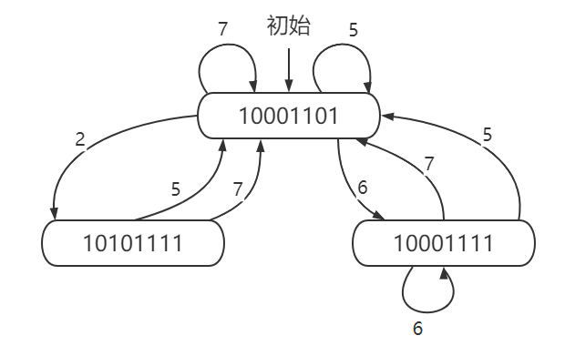
说明：
1.初始进来是冲突向量 10001101；
2.从右向左，冲突向量的第 2 位是 0，将冲突向量右移 2 位得到 00100011；
3.将这个新的向量和冲突向量做按位或，10001101 & 00100011=10101111；
4.得到了一个新的向量，就写在下面连上箭头，标注右移位数 2；
5.冲突向量中一共有 4 位是 0，分别按照上述流程计算：5、7 得到自己本身，6 得到新的向量 1000111；
6.新的向量中也有 0，也要按位右移并和冲突向量做按位或，注意 是和原始的冲突向量而不是和新的向量自己。以左下角的 10101111 为例，右移 5 位，10001101 & 00000101=10001101，连到冲突向量标记 5。

3) 周期性调度方案
-------------------------
调度方案	      平均延迟 / 拍
（2,5）	        3.5
（2,7）	        4.5
（5）	         5
（6,5）	        5.5
（6）	         6 
（6,7）	        6.5
（7）	         7
-------------------------
状态转移图中以初始冲突向量为起点，按照箭头形成一个循环回到起点就是一个调度方案，平均延迟 = 方案中箭头的数值和/箭头个数。
最小平均延迟：3.5 拍，最大吞吐率：Tpmax=1/3.5(任务/拍)

4）按（2,5）调度方案输入 6 个任务的时空图如下，实际吞吐率：Tp=6/25(任务/拍)
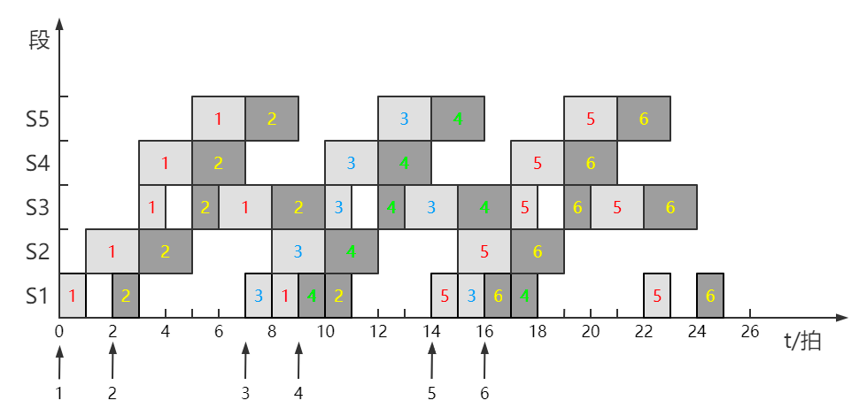
完成一项任务的和题目给出的预约表相对应，任务的输入间隔和调度方案对应；因此不画时空图也可以确定任务所花的时间2+5+2+5+2+9=252+5+2+5+2+9=25
```

## 五.4.CRAY-1 向量流水处理
```
（NOT）1.求向量D=A×(B+C)，各向量元素个数均为 N，参照 CRAY - 1 方式分解为 3 条向量指令：
① V3 ← 存储器 { 访存取A送入V3寄存器组}
② V2 ← V0 + V1{ B+C→K }
③ V4 ← V2 × V3{ K×A→D }
当采用下列 3 种方式工作时，各需多少拍才能得到全部结果？
1）①、②和③串行执行；
2）①和②并行执行后，再执行③；
3）采用链接技术。

1）①②③ 串行：
(1+6+1+N−1)+(1+6+1+N−1)+(1+7+1+N−1)=7+N+7+N+8+N=22+3N(拍)
2）①② 并行与 ③ 串行：
{ 1+6+1+N−1}
{          }  +1+7+1+N−1=15+2N(拍)
{ 1+6+1+N−1}
3）①② 并行与 ③ 链接：
{ 1+6+1}
{      } +1+7+1+N−1=16+N(拍)
{ 1+6+1}
 计算方法：
 下图为 P181 向量运算 D = A × ( B + C ) D=A\times(B+C)D=A×(B+C) 的链接过程图，做题需要记一下 CRAY - 1 各种操作的时间：整数加 3 拍、逻辑运算 2 拍、移位 4 拍、浮点加 6 拍、浮点乘 7 拍、浮点迭代求倒数 14 拍、访存 6 拍、存取数据 1 拍。

先按照本题 ①②③ 说明 3 个计算步骤的基础时间：
① 对应图中红色标注，一次计算需要取数据、访存、存数据 3 个步骤，共 1 + 6 + 1 1+6+11+6+1 拍；
② 对应图中蓝色标注，一次计算需要取数据、浮点加、存数据 3 个步骤，共 1 + 6 + 1 1+6+11+6+1 拍，这里 1 2 并行；
③ 对应图中紫色标注，一次计算需要取数据、浮点乘、存数据 3 个步骤，共 1 + 7 + 1 1+7+11+7+1 拍，这里 1 2 并行；
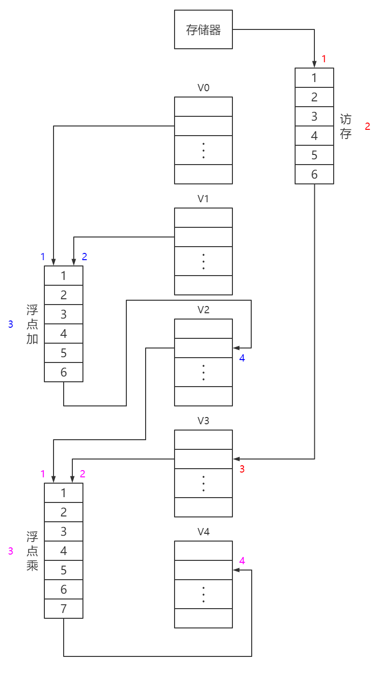
 
解释答案中的 N−1：
上面的拍数是计算的一次运算需要的时间，也就是对向量中一个元素的运算，向量中有 N 个元素，就需要额外 N −1拍。这里个人理解是内部的计算是不存在流水线瓶颈的
，可以高度并行，想象一下没有瓶颈的时空图，当得到第一个输出后，只需要增加一个Δt 就能得到第二个输出。
（1）串行：对整个向量 ① 操作结束再进行 ②，因此每个步骤都要加上 N−1。
（2）①② 并行容易理解。
（3）链接：把链接看作把 2 条流水线合并为 1 条，看作原本是要把整个向量的 ①② 步骤算完再算 ③，但是链接以后每个元素算完 ①② 可以直接算 ③，这样就实现了并行，节省了一个N−1的时间。

（YES）2.设向量长度均为 64，在 CRAY - 1 机上所用浮点功能部件的执行时间分别为：相加 6 拍，相乘 7 拍，求倒数近似值 14 拍；从存储器读数 6 拍
，打入寄存器及启动功能部件各 1 拍。
1）问下列各指令组内的哪些指令可以链接？
2）哪些指令不可链接？
3）不能链接的原因是什么？
4）分别计算出各指令组全部完成所需的拍数。
--------------
1. V0 ← 存储器
   V1 ← V2+V3
   V4 ← V5xV6
2. V2 ← V0xV1
   V3 ← 存储器
   V4 ← V0+V3
3. V0 ← 存储器
   V2 ← V0xV1
   V3 ← V2+V0
   V5 ← V3+V4
4. V0 ← 存储器
   V1 ← 1/V0
   V3 ← V1xV2
   V5 ← V3+V4
--------------
1中，没有冲突，3 条指令可以并行
{1+6+1}
{1+6+1}+N−1=9+63=72(拍)
{1+7+1}

2中，①②没有冲突并行，③有冲突但可以链接
{1+6+1}
{     }+1+6+1+N−1=9+8+63=80(拍)
{1+7+1}

3中，①②可以链接，③因为要等②算完，①的输出时间就过了（存在时间差），所以没法链接只能串行；④和③的运算都是加法只能串行（功能部件使用冲突）。
1+6+1+1+7+1+N−1+(1+6+1+N−1)∗2=222(拍)

4中，①②③④都链接
1+6+1+1+14+1+1+7+1+1+6+1+N−1=104(拍)
```

## 六.1.单级互连网络
```
实现 16 个处理单元的单级立方体互连网络。
（1）写出所有各种单级立方体互连网络函数的一般式；
（2）3 号处理单元用单级立方体互连网络可将数据直接传送到哪些处理单元上？
（3）单级立方体互连网络换成单级 PM2I 网络的前两问结果。
- 混洗交换和蝶形基本不考，简单记下互连函数即可。

1）函数一般式：
Cube0(b3 b2 b1 b0) =  b3  b2  b1 -b0-
Cube1(b3 b2 b1 b0) =  b3  b2 -b1- b0
Cube2(b3 b2 b1 b0) =  b3 -b2- b1  b0
Cube3(b3 b2 b1 b0) = -b3- b2  b1  b0
2）2（0-1，2-3）、1（0-2，1-3）、7（4+3）、11（8+3） 
- https://blog.csdn.net/ximanni18/article/details/45011153/
3）函数一般式：
PM2_+0(j)=j+1 mod 16
PM2_-0(j)=j-1 mod 16
PM2_+1(j)=j+2 mod 16
PM2_-1(j)=j-2 mod 16
PM2_+2(j)=j+4 mod 16
PM2_-2(j)=j-4 mod 16
PM2_+3(j)=j+8 mod 16
PM2_-3(j)=j-8 mod 16

1、2、4、5、7、11、15 号。
3±1=2,4
3±2=1,5
3±4=−1,7→15,7
3±8=−5,11→11,11
```

## 六.2.多级立方体网络
```
阵列有 0~7 共 8 个处理单元互连，要求按 (0,5)、(1,4)、(2,7)、(3,6) 配对通信。
（1）写出实现此功能的互连函数的一般式；
（2）画出用三级立方体网络实现互连函数的互连网络拓扑结构图，并标出各控制开关的状态。

1)Cube0(b2 b1 b0) = -b2-  b1 -b0-
把配对通信的二进制位表示写出来就能看出来（只要算一对就行，保险起见都算一算）：
(0,5)→(000,101)
(1,4)→(001,100)
(2,7)→(010,111)
(3,6)→(011,110)
2)
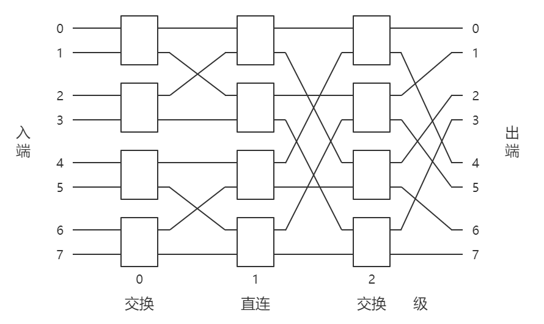

根据第一问的互连函数，0、2 位要取反，对应 0、2 级交换，1 级直连；

```

## 六.2.并行存储器无冲突访问 (NOT 19年考过)
```
在集中式主存的阵列机中，处理单元数为 4，为了使 4×4 的二维数组 A 的各元素 a_ij(i=0∼3,j=0∼3) 在行、列、主/次对角线上均能实现无冲突访问
，请填出数组各元素在存储器分体（分体号从 0 开始）中的分布情况。
假设 a_00已放在分体号为 3。体内地址（从 i+0 开始）为 i+0 的位置。
  
```

## 七.1.霍纳法则
```
由霍纳法则给定的表达式如下：E=a(b+c(d+e(f+gh)))，利用减少树高的办法来加速运算，要求：
（1）画出树形流程图；
（2）确定 Tp、P、Sp、Ep 的值。

1)
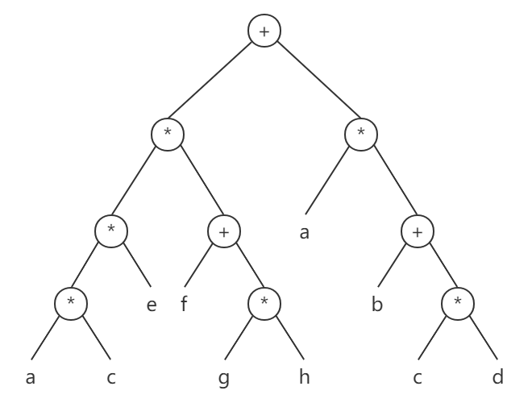
2)Tp=4、P=3、Sp=7/4、Ep=7/12

解释：
原式E=a(b+c(d+e(f+gh))) 只能从内向外依次计算，一共 7 步，不能并行，也就是只能单处理机处理，此时的树高（级数）为 T_1 = 7
将式子改写，通用方法是先完全展开，然后尽可能两两成一对并且提公因式：
E=a(b+c(d+e(f+gh)))
=ab+acd+acef+acegh
=(ab+acd)+(acef+acegh)
=a(b+cd)+ace(f+gh)
=[a(b+cd)]+[(ace)(f+gh)]
然后按公式画树形图即可，个人感觉从上往下画比较好，顶部为加法，展开两个分支，然后在逐步画各个子项的计算，这样比较容易对齐树的层级。
注意点：有些情况画法是不唯一的，例如某一项为 a b ( c + d ) ab(c+d)ab(c+d)
，此时可以 ab 和 c+d 并行再相乘分两步，也可以先算c+d 再依次乘上 a 和 b 分三步。此时需要根据题目的情况来决定
，有时按并行的两步来计算并不能减少树高，反而会增加机数（因为只一个分支不一定影响整个树高）。

级数 Tp：树高，树含有运算符的层级数量；
机数 P：有多少台处理机在进行并行运算，看每一层有多少个运算符，取最大值；
加速比 Sp = T_1/Tp：单处理机的级数和当前并行加速后的级数的比值；
效率 Ep = Sp /P：加速比除以机数。

```

## 七.2.FORK、JOIN 语句(常考)
```
若有下述程序：
U=A+B
V=U/B
W=A∗U
X=W−V
Y=W∗U
Z=X/Y
1)试用 FORK、JOIN 语句将其改写成可在多处理机上并行执行的程序。
2)假设现有两台处理机，且除法速度最慢，加、减法速度最快，请画出该程序运行时的资源时间图。

1)改写后的程序为：
---------------------------------------------------------------------------------------------------------
							| 语法解释:
---------------------------------------------------------------------------------------------------------							
10	U = A + B				| 执行语句左边的编号通常就按 10 20 30... 依次增大, 没有严格的要求
	FORK	30				| FORK	30 就代表下面一条语句和 30 号语句并行
20	V = U / B				|
	JOIN 	2				| JOIN	2 就代表有 2 条语句并行
	GOTO	40				| GOTO	40 是因为 20 运行完接下来要运行 40
30	W = A * U				|
	JOIN	2				| 30 下面不用写 GOTO	 40 是因为按顺序它运行完本来就是运行 40
40	FORK	60				| 这里的 FORK 编号是因为前面有 GOTO 要跳到这里来, 而第一条按顺序运行
50	X = W - V				| 没有别的语句要用到它的编号, 就省略了。
	JOIN	2				|
	GOTO	70				| 如果有 2 条以上的语句要并行就是多写几行 FORK, 同时 JOIN 改成对应的数量
60	Y = W * U				| 例如 20 30 40 都并行:
	JOIN	2				| FORK	30
70	Z = X / Y				| FORK	40
---------------------------------------------------------------------------------------------------------
题目给出的程序每一行就是一条指令，通过观察可以分析程序的并行性，得到程序的运行步骤：
（1）①U=A+B 执行
（2）②V=U/B 和 ③W=A∗U 可并行
（3）④X=W−V 和 ⑤Y=W∗U 可并行
（4）⑥Z=X/Y 执行


2)资源时间图
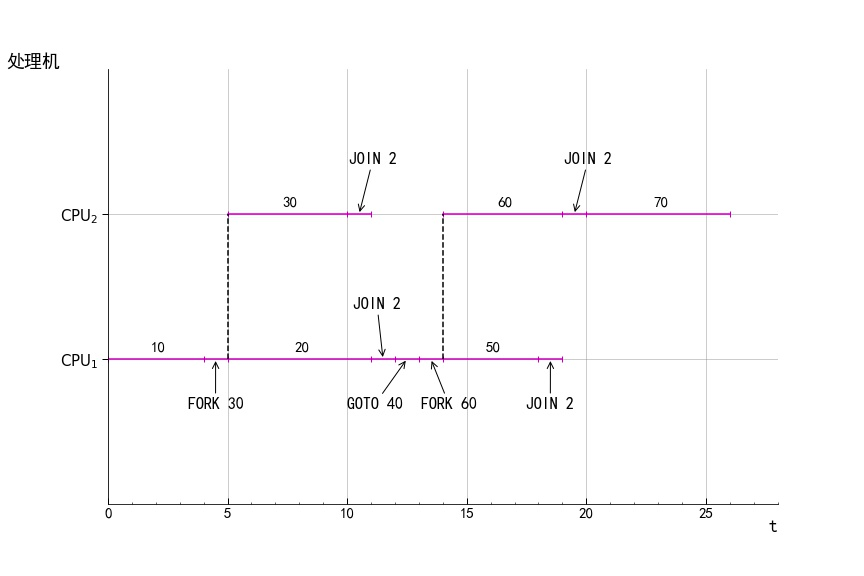
优化了一下答案的图，很多题目中只说加减法最快，除法最慢，这里直接自己规定加减法为 4，乘法 5，除法 6，FORK、JOIN、GOTO 都是 1。部分题目也会这样规定，定量画出来更直观。
画图流程和注意事项：
1.10 号语句，加法占 4 个时间
2.紧接着 FORK 30，后面按顺序运行 20，并且上面并行 30；
3.20 和 30 运行完都是接上 JOIN 2 ，JOIN 2 是个关键，它会判断 2 条并行指令是否都运行完，如果没有当前的指令就断开了要等全都运行完，如果已经都运行完了就按当前指令往下运行，如果还有指令没开始运行，就会运行未运行指令。


```

