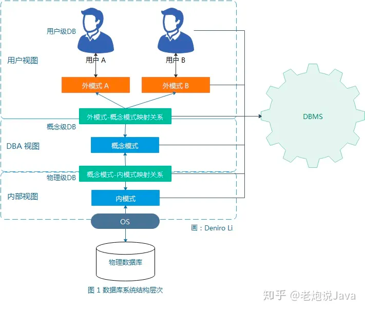
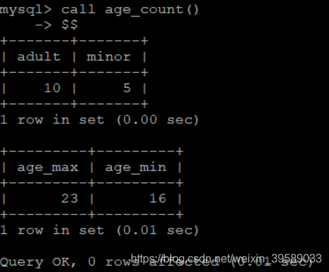

# 数据管理技术的发展
- 202304.25 202204.25 以数据模型为发展主线，数据库技术可分为三个阶段；第一代的网状、层次数据库系统、第二代的关系数据库系统、以及新一代的数据库系统。
- 经历了人工管理、文件系统、数据库系统三个阶段
- 202110.14 第三代数据库特征：继承第二代数据库系统技术、对其他系统开放、支持数据管理，对象管理和知识管理
- 201904.6 辅助软件工程工具俗称CASE工具
## 人工管理阶段特点：数据不保存、应用程序管理数据、数据面向应用， 20世纪50十年代中期以前
## 文件系统缺点：不能实现数据的普通共享、只能实现文件级的共享，而不能实现记录和数据项级别的共享, 20世纪50年代后期到60年代中期. (202010.2)
## 202104.31 数据库系统的特点：数据集成、数据共享度高、数据冗余小、数据一致性、数据独立性高、实施统一管理与控制、减少应用程序的开发和维护工作量, 20世纪60年代后期(201910.1)

# 数据库系统（DBS）

- 一个完整的数据库系统包含数据库、数据库管理系统以及相关的实用工具、应用程序、数据库管理员和用户
- 201804.11 DBS运行的最小逻辑单位是：事务
- 201804.26 使用DBS的用户分为：DBA、专用用户、应用程序员、终端用户
- 202010.24 数据库系统的开放性表现在：支持数据库语言标准、在网络上支持标准网络协议，系统具有良好的可移植性、可连续性、可扩展性、互操作性等
## 包含以下：
- 数据库（DB）
- 数据库管理系统（DBMS）

# 数据库管理系统（DBMS）
- (202204.1)用户建立数据库的一套软件、介于应用程序和操作系统之间。
- (202210.16) 数据的集成是数据库管理系统的主要目的。
## 202110.31 主要功能：
- 数据库定义功能（DDL）
- 数据库操纵功能（DML）
- 数据库的运行管理功能
- 数据库的建立维护功能
- 数据组织、存储和管理功能
- 其他功能：主要包括与其他软件的网络通讯功能，不同数据库之前相互访问和数据传输

# 数据库（DB）
- 长期存储在计算机中，有组织、可共享的大量数据集合，且数据库中的数据按照一定数据模型组织、描述、和存储
- ，具有较小的冗余度、较高的数据独立性、系统易于扩展，并可以被多用户共享。
- 202304.21、202204.21、201904.18 数据库的生命周期分为数据的【分析与设计阶段】和数据库的【实现和操作阶段】
- 202210.18 数据库的分析与设计阶段包括：需求分析、概念设计、逻辑设计、物理设计四个环节。
## 主要特点：永久存储、有组织、可共享

# 数据库系统结构
- 从数据库管理员的角度来看，数据库系统可分为内部系统结构和外部体系结构，其中内部系统结构通常采用三级模式结构
## 模式
- 也称为概念模式、逻辑模式，它是数据库中全体数据的逻辑结构和特征的描述，是所有用户的公共数据视图。
- 理解： ① 一个数据库只有一个模式； ② 是数据库数据在逻辑级上的视图； ③ 数据库模式以某一种数据模型为基础； 
- ④ 定义模式时不仅要定义数据的逻辑结构（如数据记录由哪些数据项构成，数据项的名字、类型、取值范围等），而且要定义与数据有关的安全性、完整性要求，定义这些数据之间的联系。
## 外模式
- 也称子模式、用户模式，它是数据库用户能够看见和使用的局部数据的逻辑结构和特征的描述，是与某一应用有关的数据的逻辑表示。
- 202210.9 在基本表的基础上建立必要的视图，形成数据的外模式
- 理解： ① 一个数据库可以有多个外模式； ② 外模式就是用户视图； ③ 外模式是保证数据安全性的一个有力措施。
## 内模式
- 也称为存储模式（202210.16），它是对数据库中物理结构和存储方式的描述，是数据在数据库内部的表现形式。
- 理解： ① 一个数据库只有一个内模式； ② 一个表可能由多个文件组成，如：数据文件、索引文件。 
- 它是数据库管理系统(DBMS)对数据库中数据进行有效组织和管理的方法 其目的有： ① 为了减少数据冗余，实现数据共享； ② 为了提高存取效率，改善性能。
## 三级模式的两层映像与数据独立性
- 外模式/模式映像（逻辑独立性） 201004.31
  - 外模式/模式映像定义了各个外模式与概念模式之前的映像关系，这些映像定义通常在各自的外模式中加以描述
  - 如何保证逻辑独立性：如果数据库系统的模式发生改变，数据库管理员会对各个外模式/模式映像做出相应改变，以使那些对用户可见的外模式保持不变
  - ，使应用程序的编程人员不必去修改那些依据数据外模式所编写的应用程序，如此实现了外模式不受概念模式变化的影响，并保证数据与程序之间的逻辑独立性
- 模式/内模式映像（物理独立性）
### 三级模式的数据独立性特点
- 构成数据库系统三级模式结构的三个模式分别是对数据的三级抽象，它们彼此之间具有以下特点：
- 一个数据库的整体逻辑结构和特征的描述（概念模式）是独立于数据库其他层次结构（内/外模式）的描述，其是数据库的核心，也是数据库设计的关键。
- 用户逻辑结构（外模式）是在全局逻辑结构描述的基础上定义的，它面向具体的应用程序，独立于内部模式和存储设备。
- 一个数据库的内部存储模式依赖于概念模式，但存储模式独立于外部模式，也独立于具体的存储设备。
- 特定的应用程序是在外模式的逻辑结构上编写的，它依赖于特定的外模式，与数据库的模式和存储结构独立。

# 数据模型
- 数据模型是对现实世界数据特征的抽象，描述的是数据的共性内容。
## 数据
- 是描述事务的符号记录，是指用物理符号记录下来的、可以鉴别的信息。
- 202104.18 数据聚集结构的一种有效方式是【块】结构方式
## 数据特征与数据模型组成要素
- 数据具有静态和动态两种特征：
- 其中数据的静态特征包括数据的基本结构、数据间的联系以及对数据取值范围的约束
- 数据的动态特征是指对数据可以进行符合一定规则的操作。
## (202110.16)数据模型通常由数据结构、数据操作和数据约束三个要素组成
- 数据结构描述的是系统的静态特性，即对象的数据类型、内容、属性以及数据对象之间的联系。
- 数据操作描述的是系统的动态特性，是对各种对象的实例允许执行的操作的集合，包括操作以及有关的操作规则。
- 数据约束描述数据结构中数据间的语法和语义关联，包括相互制约与依存关系以及数据动态变化规则，以保证数据的正确性、有效性和相容性。
## 数据模型的分类
- 201910.31 概念层数据模型、逻辑层数据模型、物理层数据模型
### 概念层数据模型
- 也称为数据的概念模型或信息模型，它用来描述现实世界的事物，与具体的计算机系统无关
- 基本概念：实体（Entity）、属性（Attribute）、码/键（Key）、域（Domain）、实体型（Entity Type）、实体集（Entity Set）
    、联系（Relationship）、概念模型的表示方法（用 E-R 图来描述现实世界的概念模型，实体用矩形表示，属性用椭圆表示，联系用菱形表示。
### 逻辑层数据模型
- 逻辑层是数据抽象的中间层，描述数据整体的逻辑结构。
- 201804.02 从数据可实现的观点出发，对数据建模。
- 主要的逻辑数据模型有：层次模型、网状模型、关系模型、面向对象模型
  - 层次模型 202010.26 数据库最早使用的数据模型，数据结构是一颗"有向数"，树的每个节点对应着一个记录集，也就是现实世界的实体集。 
    - 特点：1.有且仅有一个节点没有父节点，它称作根节点  2.其他节点有且仅有一个父节点。
  - 网状模型 以网状结构表示实体与实体之间的联系。
  - 关系模型 用二维表结构来表示实体与实体之间的联系的模型，并以二维表格的形式组织数据库中的数据。
    - 优点：具有更高的数据独立性、更好的安全保密性，也简化了程序员的工作和数据库开发建立的工作。
  - 面向对象模型 与数据库相结合所构成的数据模型。
### 物理层数据模型
- 也称为数据的物理模型，其描述数据在存储介质上的组织结构，是逻辑模型的物理实现，即每一种逻辑模型在实现时都有与之对应的物理模型。

# 数据库异常（202204.19）
- 插入失败：该插入的没插入；
- 插入异常：不该插入的被插入；
- 删除失败：该删除的没删除；
- 删除异常：不该删除的被删除；

# 维护
## 重构
- 202110.20 系统维护中，部分修改数据库的逻辑结构和物理结构称为重构

# 关系数据库
- 关系数据库的基本特征是使用关系数据模型组织数据，这种思想源于数学。
- 关系数据库的优点：包括高级的非过程语言接口、较好的数据独立性等，为商品化的关系数据库管理系统的研制做好了技术上的准备。
- 202010.18 关系数据库的优点：用户不需要关心存储结构和存储方法的设计
- 202304.18 在关系数据库中，关系模式是静态的稳定的。
## 202104.32 关系数据库对关系是有限定的，具体要求如下:
- 每一个属性都是不可分解的
- 每一个关系仅仅有一种关系模式
- 每一个关系模式中的属性必须命名，在同一个关系模式中，属性名必须是不同的
- 同一关系中不允许出现候选码完全相同的元组
- 在关系中元组和属性的顺序是无关紧要的，可以任意交换

## 关系数据模型
- 关系数据库系统是支持关系模型的数据库系统
- 关系模型同样包含三个组成要素: 关系数据结构、关系操作集合、关系完整性约束（202304.17、202204.16）
### 关系的完整性约束 202104.4 202010.5
- 202104.35 完整性约束作用对象是列、元祖、表
  - 列级约束是指对列的类型、取值范围、精度等的约束
  - 元祖约束是指元祖中各个字段间的相互约束
  - 表级约束是指若干元祖之间、关系之间的联系约束
- 201804.21 数据库的数据完整性是指数据库中数据的正确性、相容性和一致性（有效性），防止错误的数据进入数据库。
- 202304.31 为了维护数据库中数据的完整性，在对关系数据库执行插入、删除和更新操作时，需要检验是否满足以下三类完整性约束：
  - 实体完整性约束 （主属性不能为null）
  - 参照完整性约束 (外键要么空要么必须唯一指向对应表的主键)
  - 用户定义完整性约束 （满足域定义）
### 关系数据结构
- 关系模型只包含单一的数据结构，即关系。在关系模型中，现实世界的实体以及实体间的各种联系，均是使用关系来表示。在用户看来，关系模型是把数据库表示为关系的集合，且关系数据库是以二维表格的形式组织数据。
``
  关系=表（202210.5 在关系中每个属性都是不可分解的 202204.18关系是动态的随时间不断变化）
  基本表=一个关系对应一个基本表(202210.19 一个或多级基本表对应一个存储文件)
  元祖=行
  基数=元祖个数
  元数=列中属性个数，也叫度 （202210.3 8元关系 也叫 8度关系， 代表元祖中有8个属性 ，二元关系就是包含2个属性的元组）
  分量=属性（属性和元祖 顺叙都可以随意改变）
  码=可唯一标识实体的属性集称为码或键（202110.32 如果一个关系中存在一个这样的属性或者属性组使得关系中任何状态下的两个元祖，在该属性或属性组上的值的组合都不相同。称为码）
  超码=冗余联的合主键
  候选码=联合主键的最小集（201904.5 多个元祖不允许出现相同的候选码 202110.32 如果在关系的一个码中，不能移除任何一个码，否则他就不是这个关系的码。称这个码为候选码）
  主码=多个候选码中用来标识唯一元祖的候选码
  全码=所有分量集合（202104.17）
  码属性（主属性）=包含候选码的分量(202204.4)
  外码=另外一个关系的主码
  被参照关系=主表
  参照关系=从表
  域=取值范围
  关系模式=关系模式是对关系的描述（202210.5 每个关系是固定的唯一关系模式）
  实体=客观存在并可相互区别的事物（202104.16）
``
### 关系操作集合
#### 基本的关系操作
- 关系模型中常用的关系操作包括查询（Query）操作和插入（Insert）、删除（Delete）、修改（Update）操作两大部分。
- 查询操作分为：选择、投影、连接、除、并、差、交、笛卡尔积等。
- 查询五种基本操作：选择、投影、并、差、笛卡尔积，其他操作可以由这5种基本操作推出（202204.5）
#### 关系数据语言的分类
- 关系数据语言可以分为三类：关系代数语言、关系演算语言及兼具两种特点的语言
- 关系代数、元组关系演算和域关系演算均是抽象的查询语言。
- (202210.23)结构化查询语言 SQL 充分体现了关系数据语言的特点和优点，是关于数据库的标准语言。
#### 关系代数
- 202110.17 按照运算符的不同，关系代数操作可分为传统的集合运算和专门的关系运算
- 202010.17 关系代数是关系操作语言的一种传统表示形式，它是以集合代数发展起来的
- 集合运算符：
  - ∪	并
  - ∩	交
  - -	差
  - ⨉	笛卡尔积
- 专门的关系运算符：(202204.5 202110.17)
  - ∂	选择（水平分割）
  - π	投影（垂直分割）
  - ⨝	连接
  - ÷	除

## 关系数据库的规范化理论
### 不好的关系模式下可能存在的问题 202104.5 202010.32
- 数据冗余
- 更新异常
- 插入异常
- 删除异常
### 函数依赖（FD）
- 函数依赖是指关系中属性间的对应关系。
- 设 R 为任一给定关系，如果对于 R 中属性 X 的每一个值，R 中属性 Y 只有唯一值与之对应，则称 X 函数决定 Y 或称 Y 函数依赖于 X，记作 X -> Y，其中 X 称为决定因素。
- eg: R（用户ID 用户名称 用户年龄）， 用户年龄依赖与用户名称， 用户名称->用户年龄
#### 平凡函数依赖和非平凡函数依赖
- 平凡函数依赖：如果Y依赖于X，同时Y是X的子集，那么称X -> Y 为平凡函数依赖
- 非平凡函数依赖： Y不是X的子集
#### 完全函数依赖
- 设 R 为任一给定关系，X、Y 为其属性集，若 X -> Y，且对 X 中的任何真子集 X 都有 X -> Y，则称 Y 完全函数依赖于 X。
- eg: R（用户ID 用户名称 用户年龄 出生年月） ,用户年龄->出生年月    
#### 部分函数依赖
- 设 R 为任一给定关系，X、Y 为其属性集，若 X -> Y，且 X 中存在一个真子集 X，满足 X -> Y，则称 Y 部分函数依赖于 X。
- eg: R（用户ID 用户名称 用户年龄） ,用户名称->用户年龄
#### 传递函数依赖
- 设 R 为任一给定关系，X、Y、Z 为其不同属性子集，若 X -> Y，Y -> X，Y -> Z，则有 X -> Z，称为 Z 传递函数依赖于 X。
- eg: R（用户ID 用户名称 用户年龄） ,用户ID->用户名称, 用户名称->用户年龄, 得出传递依赖=> 用户ID->用户年龄

### 最小依赖集
- 最小函数依赖集也称为极小函数依赖集、最小覆盖；如果函数依赖集 F 满足下列条件，则称 F 为一个最小依赖集。
  -F 中任意函数依赖的右部仅含有一个属性
  -F 中不存在这样的函数依赖X→A,使得 F 与 F - {X→A}等价，即 F 中的函数依赖均不能由 F 中其他函数依赖导出
  -F 中不存在这样的函数依赖X→A，X有真子集 Z 使得 F - {X→A} ∪ {Z→A}与 F 等价，即 F 中各函数依赖左部均为最小属性集（不存在冗余属性）
- 算法步骤：
  - 将 F 中的所有函数依赖的右边化为单一属性
  - 去掉 F 中的所有函数依赖左边的冗余属性（只针对F中左部不是单一属性的函数依赖）
  - 去掉 F 中的所有冗余的函数依赖
```
假设R<U , F> ，U = ABCD，函数依赖集F={A→BD，AB→C，C→D}，求：F 最小函数依赖集

第一步：将F中的所有函数依赖的右边化为单一属性：

　　因为F = {A→BD，AB→C，C→D}，函数依赖右边化为单一属性得：F = {A→B，A→D，AB→C，C→D}；

第二步：去掉F中的所有函数依赖左边的冗余属性（只针对F中左部不是单一属性的函数依赖）

　　　F={A→B，A→D，AB→C，C→D}中只有函数依赖AB→C左部不是单一属性，所以要对其进行去掉左边冗余属性的处理：

先看A是不是冗余属性：因为BF+ ={ B }不包含A，所以A属性不冗余  //一个属性是否是冗余属性，求该函数依赖左部除要查看的属性外的其他属性的集关于 F 的闭包是否包含要查看属性
再看B是不是冗余属性：因为AF+ ={A，B，C，D} 包含的B，所以B属性冗余
 　　因此只将函数依赖AB→C左部B属性去掉，所以F={A→B，A→D，A→C，C→D}。

第三步：去掉 F 中的所有冗余的函数依赖

依据引理：设F为属性集U上的一组函数依赖，X，Y ⊆ U，X→Y 能由 F 根据Armstrong公理导出的充分必要条件是Y⊆ XF+ 。即判断 F 中一个函数依赖X→Y是否冗余，则只需要判定 Y 是否为的XF+ 子集。

 因为有F={A→B，A→D，A→C，C→D}：

先看判断函数依赖A→D是否冗余，则把函数依赖A→D从F={A→B，A→D，A→C，C→D}中去掉后得F={A→B，A→C，C→D}，求得AF+ = { A，B，C，D} 包含了D，所以为函数依赖A→D冗余，所以应该从F={A→B，A→D，A→C，C→D}中去掉函数依赖A→D，得F={A→B，A→C，C→D}
再从F={A→B，A→C，C→D}依次判断每一个函数依赖是否冗余，直至所有冗余的函数依赖都被消除。本例子中经过第1步后已消除 F 中的所有冗余函数依赖了
，因此原F={A→BD，AB→C，C→D}的最小函数依赖集为 F ={A→B，A→C，C→D}。
 
 注意点：
F的最小依赖集F m 不一定是唯一的，它与对个函数依赖FDi 及X→A中个属性的处置的顺序有关。
在本例子中在去掉F中的冗余的函数依赖时（绿色字体那一步）若不是首先判断A→D是否冗余，而是首先判断其它函数依赖是否冗余，那么所得的最小函数依赖就可能不同了
要搞清楚在判断一个函数依赖X→A是否为冗余时，是求X关于上一步所求得的新的函数依赖集 F 的闭包XF+ ，然后在判断A是否包含在该XF+ 


关系模式R<U，F>，U={A，B，C，D，E}，F={A→BC，ABD→CE，E→D}，求F的最小依赖集。
第一步：F右边单一化
得到F1={A→B，A→C，ABD→C，ABD→E，E→D}

第二步：逐个去掉X→A依赖后，设剩下函数依赖集为G，求属性集X关于G的闭包，如果闭包包含右边属性A，则去掉该函数依赖。

A→B：(A)+=AC，不包含B，保留。

A→C：(A)+=AB，不包含C，保留。

ABD→C：(ABD)+=ABCDE，包含C，去掉。

ABD→E：(ABD)+=ABCD，不包含B，保留。

E→D：(E)+=E，不包含D，保留。
(在这里，求闭包的时候，不能再用前面去掉的函数依赖了，所以最小依赖集不唯一，写出一个即可。)

所以F2={A→B，A→C，ABD→E，E→D}

第三步：对左边属性单一化，X=B1B2...Bi，逐个用B1→A替代原依赖X→A，判断属性集(X-B1)关于F的闭包，如果包含A则用X-B1代替X。

ABD→E：A→E，求(BD)+=BD，不包含E，不冗余
                 B→E，求(AD)+=ABCDE，包含E，存在冗余则使用AD→E替换ABD→E
                 D→E，求(AB)+=ABC，不包含E，不冗余

所以F3={A→B，A→C，AD→E，E→D}
继续第三步
AD→E：A→E，求(D)+=D，不包含E，不冗余
               D→E，求(A)+=ABC，不包含E，不冗余

所以最小依赖集Fm={A→B，A→C，AD→E，E→D}

```

### 属性集合的闭包
#### 闭包
- 设有关系模式R（U），U是属性集，F是函数依赖集，X⊆U。F+中所有X->A的A的集合称为X的闭包，记为X+。
#### 求取属性集闭包的步骤：
- 设要求的闭包属性集是Y，把Y初始化为X.
- 检查函数依赖集F中的每个函数依赖A->B,如果属性集A中的所有属性都在Y中，而B中有属性不在Y中，则将其加入到Y中。
- 重复第二步，直到没有属性可以添加到Y中为止。最后得出的Y就是X+。
```
设有关系模式R（M,N,X,Y,Z）其依赖集F={M->H,H->Z,Y->Z,N->Y,Z->M}。求M+,MH+
第一步：设要求的闭包属性集是Y，把Y初始化为X.
令X={M},我们先看M->H,由于函数依赖M->H左边的所有属性都在X中，而右边H不在X中，所以可以把H添加到X 中，此时X={M，H}

然后按照顺序我们再看H->Z，我们不难发现函数依赖H->Z左边的所有属性都在X中,右边的属性Z又不在X中，仍旧添加，这时X={M，H，Z}

下一个
Y->Z，可以发现Y属性不在X中，条件不满足
N->Y，可以发现N属性不在X中，条件不满足
Z->M,Z属性在X中条件满足，但右边M也在X中条件不满足。

属性判断完 ，那么属性M的闭包：M+=MHZ。

MH+的求法也一样

令X={M,H},先看M->H，不难看出M在X中，H也在，右不满足。

H->Z，H在X中，属性Z不在，所以可以把Z加入到X中，这时X={M,H,Z}

Y->Z，Y属性就不满足，pass

N->Y，N属性也不在X中，pass

Z->M，右边M属性在X中不满足添加条件

即MH+=MHZ
```

## 关系规范化 202104.36
- (202210.8) 关系规范化理论主要应用于数据库设计中的概念设计阶段
### 范式与关系规范化过程
- 一个低一级范式的关系模式通过模式分解可以转换为若干个高一级范式的关系模式的集合，这种过程化就叫规范化。
#### 第一范式（1NF）
- 设 R 为任一给定关系，如果 R 中每一列与行的交点处的取值都是不可再分的基本元素，则称 R 为第一范式。
#### 第二范式（2NF）
- 设 R 为任一给定关系，若 R 为 1NF，且所有非主属性都完全函数依赖与候选关键字，则 R 为第二范式。
- 一是表必须有一个主键；二是没有包含在主键中的列必须完全依赖于主键，而不能只依赖于主键的一部分。
#### 第三范式（3NF）
- 设 R 为任一给定关系，若 R 为 2NF，且所有非主属性都不传递函数依赖于候选关键字，则 R 为第三范式。
- 一个订单表【Order】（OrderID，OrderDate，CustomerID，CustomerName，CustomerAddr，CustomerCity）主键是（OrderID）。
- 其中 OrderDate，CustomerID，CustomerName，CustomerAddr，CustomerCity 等非主键列都完全依赖于主键（OrderID）
- ，所以符合 2NF。不过问题是 CustomerName，CustomerAddr，CustomerCity 直接依赖的是 CustomerID（非主键列）
- ，而不是直接依赖于主键，它是通过传递才依赖于主键，所以不符合 3NF。

## 关系数据库设计方法（开下试卷，考的不多就不补充了，以下只是重点概念）
- 数据库设计的基本步骤：需求分析、逻辑结构设计、物理结构设计、数据库实施、数据库的运行和维护等阶段。
- 202304.21、202204.20、201910.17 从用户对【数据】的需求出发，数据库设计包括数据库结构设计和数据库行为设计
- 202104.6 数据库设计方法：直观设计法、规范设计法、计算机辅助设计法
- 201910.7 数据库设计有两个重要的目标：满足应用功能需求和良好的数据库性能
### 各任务步骤 
- 需求分析：分析用户的需求，包括数据、功能和性能需求；
- 概念结构设计：主要采用E-R模型进行设计，包括画E-R图；
- 逻辑结构设计：E-R模型到关系模型的转换，设计面向用户的外模式，关系数据模型优化（202204.8）
  - 202210.31 关系数据模型优化方法：
  - 确定各属性的函数依赖关系
  - 对与各个关系模式之间的数据依赖进行极小化处理消除冗余联系
  - 确定每个关系模式的范式，根据实际需确定最合适的范式
  - 按照需求分析阶段的处理要求，对某些模式进行合并或分解
  - 对关系模式进行必要的分解，提高数据库操作效率和存储空间利用率
- 数据库物理设计：主要是为所设计的数据库选择合适的存储结构和存取路径；
- 数据库的实施：包括编程、测试和试运行；
- 数据库运行与维护：系统的运行与数据库的日常维护。

### E-R 图的表示方法
- 实体型，用矩形表示，写明实体的名称
- 属性，用椭圆形表示，并用无向边将其与相应的实体连接起来
- 联系，用菱形表示，写明联系的名称，用无向边分别与有关实体连接起来，同时在无向边旁标注联系的类型（1:1、1:N 或 M:N），如果一个联系具有属性，则这些属性也要用无向边与该联系连接起来
- 局部信息结构的设计步骤包括确定局部范围、选择实体、选择实体关键字、确定实体间联系、确定实体的属性。
- 202110.12 各局部 E-R 图之间的冲突主要表现在三个方面：属性冲突、命名冲突、结构冲突

## SQL 与关系数据库基本操作
- 202210.33 核心组成部分：数据定义语言（DDL）、数据操纵语言（DML）和数据控制语言（DCL）、嵌入式和动态SQL规则 、SQL调用和会话规则。
- 201904.33 SQL调用及主要目的
  - SQL的调用包含SQL例程和调用规则，目的：
  - 提高SQL的灵活性
  - 提高SQL的有效性
  - 提高SQL的共享性
  - 使SQL具有更多高级语言特性
### 数据定义语言DDL：对数据库对象进行创建、删除、修改等操作。
- 数据库对象主要有表、默认约束、规则、视图、触发器、存储过程等。
```
create database 数据库名;

drop database 数据库名;

create table 表格名(
列名 类型 [属性] [索引] [注释]，
列名 类型 [属性] [索引] [注释]，
列名 类型 [属性] [索引] [注释]
);

# 202304.35 电影（_电影编号，电影名，电影类型） 演员（_身份证号，姓名，性别，年龄） 出演（…电影编号_1，…身份证号码_2，拍摄年份）
# 202304.36 主键的声明
CREATE TABLE 演员(
    身份证号码 CHAR(18),
    姓名 CHAR(20),
    性别 CHAR(2),
    年龄 INT,
    PRIMARY KEY(身份证号)
);
CREATE TABLE 演员(
    身份证号码 CHAR(18) PRIMARY KEY,
    姓名 CHAR(20),
    性别 CHAR(2),
    年龄 INT
);
# 外键的声明
CREATE TABLE 出演(
    电影编号 CHAR(20),
    身份证号码 CHAR(18),
    拍摄年份 CHAR(10),
    FOREIGN KEY(身份证号码) REFERENCES 演员(身份证号),
    FOREIGN KEY(电影编号) REFERENCES 电影(电影编号),
    # 创建联合主键
    primary key(电影编号,身份证号码)
);
CREATE TABLE 出演(
    电影编号 CHAR(20) REFERENCES 电影(电影编号),
    身份证号码 CHAR(18) REFERENCES 演员(身份证号),
    拍摄年份 CHAR(10),
    # 创建联合主键并命名
    constraint 主键约束的名字 primary key(电影编号,身份证号码)
);
# 删除外键
ALTER TABLE <表名> DROP FOREIGN KEY <外键约束名>;

show create table 表格名; #查看表格定义语句
desc 表格名; #显示表的具体结构

alter table 旧表名 rename as 新表名;
alter  table  表名  add  列名  类型; #增加一列
alter  table  表名  modify  列名  修改后的类型; #修改一列
alter  table  表名  drop  列名; #删除一列

drop  table  [if  exits] 表格名;
```
### 数据操纵语言DML：SELECT、INSERT、UPDATE、DELETE
### 数据控制语言DCL：GRANT（授权）、REVOKE（权限回收）
- 创建角色 （202104.13 默认权限 可以链接数据库）
```
# 201910.20 IF EXISTS
CREATE ROLE [IF NOT EXISTS] role [, role ] ...

CREATE ROLE 'admin';

# 角色授权给用户
SET DEFAULT ROLE 'admin' TO  'user'@'%';
```
- 创建用户,如果想让该用户可以从任意远程主机登陆，可以使用通配符% (202110.23 创建用户后会在系统自身的mysql库的user表中插入一条新记录)
```
CREATE USER 'username'@'host' IDENTIFIED BY 'password'; 

# eg
CREATE USER 'dog'@'localhost' IDENTIFIED BY '123456';
CREATE USER 'pig'@'192.168.1.101_' IDENDIFIED BY '123456';
CREATE USER 'pig'@'%' IDENTIFIED BY '123456'; 
```
- 202110.23 修改用户
```
在MySQL中，我们可以使用RENAME USER语句修改一个或多个已经存在的用户账号。
RENAME USER <旧用户> TO <新用户>
#使用 RENAME USER 语句，必须拥有 mysql 数据库的 UPDATE 权限或全局 CREATE USER 权限。

```
- GRANT：授予用户SELECT、INSERT、UPDATE、DELETE等权限，或者撤销用户对数据库对象的权限。
- 201910.12 $table_name 指的是权限级别priv_level
```
GRANT SELECT,INSERT ON table_name TO user_name; #授权用户SELECT INSERT权限
GRANT ALL PRIVILEGES ON table_name TO user_name; #授权用户所有权限

# 授权角色role_name对表table_name进行所有操作，并将该角色授权给用户user_name。
GRANT ALL PRIVILEGES ON table_name TO role_name;
GRANT role_name TO user_name;

```
- GRANT用于授权给用户或用户组访问数据库对象的权限。 
```
REVOKE SELECT,INSERT ON table_name FROM user_name; # 撤销用户INSERT、SELECT权限
REVOKE ALL PRIVILEGES ON table_name FROM user_name; #撤销用户所有权限

#撤销角色所有权限
REVOKE ALL PRIVILEGES ON table_name FROM role_name;
REVOKE role_name FROM user_name;

#201910.21 删除一个或多个用户账户账户以及权限
DROP USER
```
- 索引，检索索引的方式通常有 静态和动态（202210.6）
```
静态索引结构指这种索引结构在初始创建，数据装入时就已经定型，而且在整个系统运行期间，树的结构不发生变化，只是数据在更新。
动态索引结构是指在整个系统运行期间，树的结构随数据的增删及时调整，以保持最佳的搜索效率。

静态索引结构的优点是结构定型，建立方法简单，存取方便；缺点是不利于更新，插入或删除时效率低。
动态索引结构的优点是在插入或删除时能够自动调整索引树结构，以保持最佳的搜索效率；缺点是实现算法复杂。
```

## MYSQL(关系数据库系统RDBMS)
- 关系数据库系统支持三级模式结构，其模式、外模式和内模式中的基本对象有数据库模式、表、索引、视图等。
- 202010.7 使用mysql构建的互联网网站架构方式称为WAMP
- 201910.7 LAMP:即使用 Linux 作为操作系统，Apache 作为 Web 服务器，MySQL 作为数据库管理系统，PowerShell(PHP、Perl 或 Python 语言)作为服务器端脚本解释器。
- WAMP:即使用 Windows 作为操作系统，Apache 作为 Web 服务器，MySQL 作为数据库管理系统，PowerShell(PHP、Perl 或 Python 语言)作为服务器端脚本解释器。
- 201904.23 开启事务需要使用【InnoDB引擎】
### 内置函数：
- 数学函数，如 ABS()、SORT()
- 聚合函数，如 COUNT()
- 字符串函数，如 ASCII()、CHAR()
- 日期和时间函数，如 NOW()、YEAR()
- 加密函数，如 ENCODE()、ENCRYPT() 201910.8
- 控制流程函数，如 IF()、IFNULL()
- 格式化函数，如 FORMAT()
- 类型转换函数，如 CAST()
- 系统信息函数，如 USER()、VERSION()
### 视图
- 202204.30 ex: CREATE VIEW V_HW(GNAME,SPNO,DATE,LXR) AS SELECT GNAME,SPNO,DATE,LXR FROM GYS,GY where GYS.GNO = GY.GNO and GNAME = 'HW';
- (201904.19) 从一个或几个基本表导出的表，其本身不独立存储在数据库中称为视图。
- (202010.17) 视图表是由基本表和其他视图导出的表，是虚表，不对应实际的存储数据。
- (202110.21、202304.32)外模式对应到数据库中的概念就是视图。（202304.32）视图是数据库中的一个对象，它是数据库管理系统提供给用户的以多种角度观察数据库中数据的一种重要机制。
- 202010.33 使用视图有以下优点：
  - 集中分散数据
  - 简化查询语句
  - 重用 SQL 语句
  - 保护数据安全
  - 共享所需数据
  - 更改数据格式
- 202204.32 视图和基本表的区别
  - 视图不是数据库中的真实表，而是一张虚表
  - 视图的内容由存储在数据库中进行查询的sql语句来定义
  - 视图所对应的数据实际存储在视图所引用的基本表中
  - 视图是用来查看存储在别处数据的一种虚表，自身不存储数据
- 视图相关sql:
```
CREATE VIEW view_name[(column_list)] 
AS select_statement [WITH[CASCADED|LOCAL]CHECK OPTION]

DROP VIEW [IF EXISTS]
view_name[,view_name]...
[RESTRICT|CASCADE]

ALTER VIEW view_name[(column_list)]
AS select_statement [WITH[CASCADED|LOCAL]CHECK OPTION]

SHOW CREATE VIEW view_name

# 更新视图，实质上是更新视图所引用的基本表中的数据
INSERT INTO mysql_test.customer_view VALUES(909,'周明','M','武汉市','洪山区')
UPDATE mysql_test.customer_view SET cust_address = '上海市'
DELETE FROM mysql_test.customer_view WHERE cust_name = '周明' #对于依赖多个基本表的视图，不能使用 DELETE 语句。
```

## 数据库编程（存储过程）
- 201804.23优点：提供了安全机制、改进了执行性能、减少了网络流量和增强了代码重用性
- 202304.10 声明时在名称前使用@的变量是用户变量
- 202010.10 存储函数必须包含return
- 202304.33 存储过程通常具有以下一些好处：
  - 可增强 SQL 语言的功能和灵活性
  - 良好的封装性
  - 高性能
  - 可减少网络流量
  - 存储过程可作为一种安全机制来确保数据库的安全性和数据的完整性 （201910.22 数据库的完整性是指数据库中数据的【正确性】和【相容性】）
- 202204.33 存储过程和存储函数的区别
  - 存储函数不能拥有输出参数，因为存储函数自身就是输出参数，存储过程可以有输出参数
  - 存储函数可以直接调用不需要使用CALL，存储过程需要使用CALL来调用
  - 存储函数必须包含return语句，存储过程中无法使用return
- 202010.34 使用局部变量需要注意的事项：
  - 只能在存储过程提 BEGIN...END 语块中声明
  - 必须在存储过程体的开头声明
  - 作用范围仅限于声明体中，其他语块无法使用
  - 局部变量不同于用户变量，用户变量需要再名称前加上@标识
- 201904.34 局部变量和用户变量的区别：
  - 局部变量声明没有在其前添加@，只能在存储过程提 BEGIN...END 语块中声明，作用范围仅限于声明体中，其他语块无法使用
  - 用户变量声明时会在前面添加@，同时以声明的用户变量存在于整个会话中
- 201910.33 变量的含义：
  - 变量用于临时存储数据，变量中的数据可以随着程序的运行而变化；
  - 变量属性有名字、数据类型；
```
# 创建一个存储过程
delimiter $$ //这是定义一个结束符$$
create procedure [存储过程名称]([参数])
begin
......
end$$
delimiter ; //重新定义结束符为 ;

# 创建一个统计课程数量的存储过程：
create procedure count_course()
begin
select count(*) from course;
end$$

# 调用
call count_course$$

# 创建存储函数语法
CREATE FUNCTION 存储函数名 （[参数[,...]]）
RETURNS 类型
函数体
# 创建存储函数 202010.10 由sql语句和过程语句组成，不能拥有输出参数、不需要使用call调用，必须含有return 
DELIMITER $$
CREATE FUNCTION num_book()
RETURNS INTEGER
BEGIN
RETURN(SELECT COUNT(*)FROM Book);
END$$
DELIMITER ;

# 202210.34 删除存储函数，注意事项： 
# 1.删除前必须确认该存储函数没有任何依赖关系，否则会导致其他与之关联的存储函数无法运行
# 2.为了防止删除不存在存储函数导致错误，可以再DROP FUNCTION 语句中添加 IF EXISTS
DROP FUNCTION [ IF EXISTS ] 存储函数名


# 202110.22 declare变量定义，在无参数的情况下返回变量值，可以用select语句。
# 202104.20 default 指定默认值 	declare boys int default 0;
create procedure test()
begin
declare boys int(10);
declare girls int(10);
select count(*) into boys from student where Ssex='男';
select count(*) into girls from student where Ssex='女';
select boys,girls;
end$$

# 创建一个显示成年人和未成年人数量的表以及最大年龄和最小年龄的存储过程函数：
delimiter $$
create procedure age_count()
begin
	begin
		declare adult int;
		declare minor int;
		select count(*) into adult from student where Sage>=18;
		select count(*) into minor from student where Sage<18;
		select adult,minor;
	end;
	begin
		declare age_max int;
		declare age_min int;
		select max(Sage) into age_max from student;
		select min(Sage) into age_min from student;
		select age_max,age_min;
	end;
end$$
delimiter ;
# 显示结果



# 202010.20 存储过程参数，不指定参数类型的情况下，传进来的参数默认是in类型
drop procedure findname;
delimiter $$
create procedure findname(sno int)
begin
	declare name varchar(10);
	select Sname into name from student where Sno=sno limit 1;
	select name;
end$$
delimiter ;
# 调用
call findname(2);


# 使用 out 类型的参数输出，结果应该与上题一致
drop procedure findname;
delimiter $$
create procedure findname(in sno int,out sname varchar(10))
begin
	select Sname into sname from student where Sno=sno limit 1;
end$$
delimiter ;
# 调用
set @name='';
call findname(2,@name);
select @name as studentname;

# 202204.22 202210.33 条件语句，if 语句需要有 end if 来结束 if 语句
begin
if(...)
then
	......
elseif(...)
then
	......
else 
	......
end if;

end$$

# 判断Cno是否有空值
delimiter $$
CREATE PROCEDURE ifnull()
begin
	declare flag int;
	select count(*) into flag from student where Cno is null;
	if flag is null
		then select '没有空值' as '是否有空值';
		else select '仍有空值' as '是否有空值';
	end if;
end
delimiter ;

# 202204.22 202210.33 case语句可以计算多个条件式，并将其中一个符合条件的结果报答是返回
case [测试表达式]
when [测试值1] then [结果表达式1]
when [测试值2] then [结果表达式2]
when [测试值3] then [结果表达式3]
......
else [结果表达式0]
end

# 根据输入的课程名，添加一行课程类别
create procedure course_cate(cid varchar(10))
begin
update course set cate=
case(select cname from course where Cid=cid)
when '语文' then '文科'
when '数学' then '理科'
else 'x'
end case
end

# 202210.33 while循环 | repeat | loop
begin
	while([执行条件]) do
	......
	end while;
end;

begin
	repeat
	......
	until [跳出条件]
	end repeat;
end;

begin
	[循环名称]:loop
		......
		if [跳出条件] then leave [循环条件];
		end if;
	end loop [循环名称];
end


# 循环，随机从1~100分插入成绩，输入参数i 作为需要修改成绩的人数，使用while循环一行行修改成绩
drop procedure add_math_score();
delimiter $$
create procedure add_math_score(i int)
begin
	declare n int default 0;
	declare score int default 0;
	while(n<i) do
	begin
		set n=n+1;
		set score=floor(100*rand());
		select score ;
		update student set Sscore=score where Sno=n;
	end;
	end while;
end$$
delimiter ;


# 201804.29 202104.34 为什么要用游标：使用SELECT语句进行检索时返回的是一组结果集的数据行，而主语言语句一次只能处理一个记录，因此需要游标机制；
# 201910.34 游标Cursor：游标是被一个SELECT语句检索出来的结果集，游标充当指针的作用，每次提取一条记录的机制。
# 201910.34 定义游标 DECLARE CURSOR
declare stopflag int default 0;
declare [游标名] cursor for [sql查询语句];
declare continue handler for not found set stopflag=1;//使用越界标志控制循环
# 打开游标 
open [游标名];
# 取值 (202210.20)
fetch [游标名] into [变量名];
# 关闭游标
close [游标名]
# eg, 把student表中Sno为偶数的学生改名
create procedure change_cursor()
begin
declare student_name varchar(10);
declare stopflag int default 0;
declare name_cur cursor for select Sname from student where Sno%2=0;
declare continue handler for not found set stopflag=1;
open name_cur;
fetch name_cur into student_name;
while(stopflag=0) do
begin
# 202210.30 UPDATE table_name SET ... WHERE ... (没有FROM)
update student set Sname=concat(student_name,'雨课堂') where Sname=student_name;
# 游标select的字段数需要与fetch into的变量数一致
fetch name_cur into student_name;
end;
end while;
close name_cur;
end;

```

## 数据库安全与保护
- 201804.27 投入运行后维护工作包括：数据库的转储与恢复、数据库的安全性与完整性控制、数据库性能监督，分析和改进、数据库的重组织和冲构造；
- 201804.30、201904.16 数据库可恢复性：系统DBMS能把数据库从被破坏、不正确状态，恢复到最后一个【正确】的状态。（201910.16 数据库的故障恢复）
- 201804.31 数据库并发操作带来的问题： 丢失更新问题、读脏数据、不可重复读问题
- 202304.12 命名完整性约束的关键字是：constraint ( constraint t_user_id_pk primary key(id) ) （202210.21 语法：constraint+该约束的名字）
- 非空约束(not null)、 唯一性约束(unique)、 主键约束(primary key) PK、 外键约束(foreign key) FK
- 202104.22 数据库系统对数据的安全管理是使用【身份验证]、【数据库用户权限确认】等访问控制措施
### 数据库完整性
- 数据库完整性是指数据库中数据的正确性和相容性。 
- （202204.23）完整性约束条件：列、元祖、表
#### 定义与实现完整性约束
- 关系模型的完整性规则是对关系的某种约束条件，有 3 类完整性约束：实体完整性约束、参照完整性约束、用户定义的完整性约束
- 202204.31 关系的两个不变性及其含义：实体完整性约束、参照完整性约束是关系模型必须满足的完整性约束条件，被称做关系的两个不变性
#### 完整性约束条件的作用对象：(202210.21) 
- 列级约束，主要是指对列的类型、取值范围、精度等的约束
- 元组约束，指元组中各个字段之间的相互约束，例如某个活动的开始日期小于结束日期。
- 表级约束，指若干元组之间、关系之间的联系的约束。
##### 实体完整性约束 
- 202204.31 201910.32 实体完整性是指关系的主属性不能为空
  - 201910.32 补充：关系对应现实世界中的实体集，而现实世界的实体是可区分的，即说明每个实体有唯一标识；在关系模式中使用主码作为唯一标识，若主码为空，则说明这个实体不可区分；
- 201904.21 在MYSQL中，实体完整性是通过【主键约束】和【候选键约束】来实现的
##### 参照完整性约束
- 202204.31 201904.32 定义外码和主码之间的引用规则，他是对关系间引用数据的一种限制
  - 201904.32补充：若属性F是基本关系R的外码，外码F对应着关系S的主键K,则对于基本关系R的元祖集中的属性F要么为空，要么等于关系S中某个元祖的主码值
- 在 MySQL 中，参照完整性是通过在创建表 CREATE TABLE 或更新表 ALTER TABLE 的同时定义一个外键声明来实现的。
##### 用户定义的完整性约束
- 非空约束
- CHECK 约束
##### 202210.32 完整性约束检验方法
- 执行插入操作，首先检验实体完整性约束，然后检查参照完整性约束，最后检查用户定义完整性约束
- 执行删除操作，一般只需要对被参照关系检查参照完整性约束
- 执行更新操作时，因为更新可以看做先删除在插入，所以是以上两种的总和

### 触发器
- （202304.24 201910.35）触发器是用户定义在关系表上的一类由事件驱动的数据库对象，也是一种保证数据完整性的方法。
  - 201910.35 主要作用：是实现主键和外键不能保证的复杂的参照完整性和数据一致性，从而有效的保护表中的数据
```
# trigger_name 用于指定触发器的名称，触发器在当前数据库必须具有唯一的名称，如果要在某个特定数据库中创建，名称前面应加上数据库的名称
# trigger_time 指定触发器的触发时刻，它有两个选项，即关键字 BEFORE 和 AFTER，用于表示触发器是在激活它的语句之前或之后触发。如果希望验证新数据是否满足使用限制，则使用 BEFORE 选项；如果希望在激活触发器的语句执行之后完成几个或更多的改变，通常使用 AFTER 选项
# trigger_event 指定触发事件，即指定激活触发器的语句的种类，其可以是下述值之一：关键字 INSERT，表示将新的数据行插入到表时激活触发器；关键字 UPDATE，表示更改表中某一行数据时激活触发器；关键字 DELETE，表示从表中删除某一行时激活触发器
# tb1_name 指定与触发器相关联的表名，必须引用永久性表，不能将触发器与临时表或视图关联起来，且同一个表不能拥有两个具有相同触发时刻和事件的触发器
# FOR EACH ROW 指定对于受触发事件影响的每一行都要激活触发器的动作
# trigger_body 指定触发器动作主体，即包含触发器激活时将要执行的 MySQL 语句，如果要执行多个语句，可使用 BEGIN ... END 复合语句结构
CREATE TRIGGER trigger_name trigger_time trigger_event
ON tb1_name FOR EACH ROW trigger_body

# IF EXISTS 用于避免在没有触发器的情况下删除触发器
# schema_name 指定触发器所在的数据库的名称，若没有指定，则为当前默认数据库
# trigger_name 指定要删除的触发器名称
DROP TRIGGER [IF EXISTS] [schema_name.] trigger_name

#删除学生表数据后同时删除成绩表中对应学生的成绩信息，保持了数据的完整性，一致性。
create trigger student_after_delte AFTER DELETE on student
for each row
begin
DELETE from sc where sc.sno=old.sno;
end

```

### 事务与并发控制
- 事务就是用户定义的一个数据操作序列，这些操作可作为一个完整地工作单元，要么全部执行，那么全部不执行，是一个不可分割的工作单元
- 201804.22 多个事务依次执行，称为事务的串行调试
- 202110.24 在数据库系统中，可串行性就是并发执行的正确性准测
- 202304.34 并发操作带来数据不一致的原因?并发操作破坏了事务的隔离性; 解决办法?封锁、时间戳、乐观控制法、多版本并发控制
#### 事务的特征
- 原子性
- 一致性
- 隔离性
- 持续性(持久性)
#### 202210.35，202204.34 并发操作问题
- 丢失更新(设有两个事务T1，T2。当他们同事读入同一个数据并修改时，事务T2的提交结果会破坏事务T1的提交结果)
- 不可重复读（设有两个事务T1，T2。T1读取结果后，T2进行修改，T1无法复现前一次读取结果）
- 读脏数据（设有两个事务T1，T2。T1修改某一数据并写回磁盘，T2读取数据后T1由于某种原因修改被撤销，T1已修改的数据恢复原值，导致T2读取的数据与数据库不一致，此时称T2读到的数据位脏数据）
#### 封锁
- 基本的封锁类型有两种：排他锁和共享锁。
- 利用封锁机制可以解决并发操作所带来的三个不一致问题。
- 201804.32 封锁的粒度：封锁对象的大小
- 202104.12 防止备份过程中表被其他用户更新，需要在指定表上做一个读锁定
- 202104.21 活锁问题的解决与调度算法有关，一种最简单的方法是 "先来先服务"
- 201904.22 一个锁实质上就是允许或阻止一个事务对一个数据对象的【存取特征】
- 202010.35 封锁的工作原理:
  - 若事务T对数据D加了X锁，则所有别的事务对数据D的锁请求都必须等待事务T释放锁
  - 若事务T对数据D加了S锁，则所有别的事务对数据D的还可以请求S锁
  - 对读请求添加S锁，对更新请求X锁
  - 事务一直占有获得的直到结束（COMMIT or ROLLBACK）时释放
- 201904.35 封锁的级别：
  - 0级封锁,被封锁的事务不重复写其他非0级封锁事务的未提交更新数据
  - 1级封锁,被封锁的事务不允许重写未提交的更新数据
  - 2级封锁,被封锁的事务既不重写也不读未提交的更新数据
  - 3级封锁,被封锁的事务不读未提交的更新数据，不写任何未提交的数据

### 备份与恢复
- 202110.35 数据库备份是指通过导出数据或者复制文本的方式来制作数据库副本
- 202110.35 数据恢复则是当数据库出现故障或者被破坏时，将备份的数据加载到系统，从而使数据库从错误状态恢复到备份时的正确状态
- 202110.35 备份与恢复策略来保证数据库中数据的可靠性与完整性。
- 会造成数据库运行事务异常中断的因素可能是：
  - 计算机硬件故障
  - 计算机软件故障
  - 病毒
  - 认为误操作
  - 自然灾害
  - 盗窃
```
#使用 SELECTION ... OUTFILE 语句备份数据 202010.12, 202304.35
SELECT * INTO OUTFILE 'file_name' export_options|INTO DUMPFILE 'file_name'
# export_options 的格式
[FIELDS
 [TERMINATED BY 'string']
 [[OPTIONALLY]ENCLOSED BY 'char']
 [ESCAPED BY 'char']
]
[LINES TERMINATED BY 'string']
# file_name 指定数据备份文件的名称
# 导出语句中使用关键字 OUTFILE 时，可以在语法项 export_options 中加入两个自选的子句，即 FIELDS 子句和 LINES 子句，它们的作用是决定数据行在备份文件中的存储格式。如果 FIELDS 子句和 LINES 子句都不指定，则默认声明的是子句 FIELDS TERMINATED BY '\t' ENCLOSED BY ESCAPED BY '\\' LINES TERMINATED BY '\n'
# FIELDS 子句中有三个亚子句，分别是 TERMINATED BY 子句、[OPTIONALLY]ENCLOSED BY 子句和 ESCAPED BY 子句。如果指定了 FIELDS 子句，则这三个亚子句中至少要求指定一个。其中，TERMINATED BY 子句用来指定字段之间的符号。
# 在 LINES 子句中使用关键字 TERMINATED BY 指定一个数据行结束的标志
# 导出语句中使用的是关键字 DUMPFILE 而非 OUTFILE 时，导出的备份文件里面所有的数据行都会彼此紧挨着放置，即值和行之间没有任何标记。

# 使用 LOAD DATA ... INFILE 语句恢复数据(202210.13 2024.35)
LOAD DATA INFILE 'file_name.txt'
INTO TABLE tb1_name
[FIELDS
 [TERMINATED BY 'string']
 [[OPTIONALLY] ENCLOSED BY 'char']
 [ESCAPED BY 'char']
]
[LINES
 [STARTING BY 'string']
 [TERMINATED BY 'string']
]
# file_name 指定待导入的数据库备份文件名，文件中保持了待载入数据库的所有数据行
# tb1_name 指定需要导入的数据库的表名
# 此处的 FIELDS 子句和 SELECT * INTO OUTFILE 语句中的 FIELDS 子句类似，用于判断字段之间的数据行之间的符号
# 语法项 LINES 子句中的 TERMINATED BY 亚子句用来指定一行结束的标志；STARTING BY 亚子句则指定一个前缀，导入数据行时，忽略数据行中的该前缀与前缀之前的内容。如果某行不包括该前缀，则整个数据行被跳过。

# 备份恢复前加锁
LOCK TABLES table_name WRITE;
# 备份或恢复完解锁 201910.13 202204.35
UNLOCK TABLES;


```

# 数据仓库与数据挖掘
- 202210.14 202104.24 数据仓库是面向主题的、集成的、稳定的、随时间变化的【数据集合】，用以支持管理决策的过程。
- 一般针对某些主题的历史数据进行分析，支持管理决策的是联机分析处理
## 数据库到数据仓库
- 计算机系统中存在着两类不同的数据处理工作：一类是操作型处理，也称联机事务处理，另一类是分析型处理，也称联机分析处理。
- 事务型处理数据(OLTP)和分析型处理数据(OLAP)
- 数据仓库的特征：202204.14、201904.14
  - 面向主题
  - 集成性
  - 数据的非易失性
  - 数据的时变性
- 数据仓库三个常用的重要概念：
  - 粒度(202104.24 保存数据的细化或综合程度的级别 201910.24 之所以是主要的合集问题，因为粒度影响存储数据的【数据量大小】)
  - 分割(202210.24 将数据分散到各自的物理单元中，以便能分别处理，以提高数据处理的效率)
  - 维 （观察数据的数据域，例如时间、地点、产品等；）
## 数据挖掘技术
  - OLAP 与数据挖掘的区别：
    - 在数据仓库技术中，OLAP 是数据汇总/聚集工具，可帮助简化数据分析，而数据挖掘是自动地发现隐藏在大量数据中的隐含模式和有趣知识；
    - OLAP 工具的目标是简化和支持交互式数据分析，而数据挖掘工具的目标是尽可能自动处理。
    - 数据挖掘是自动地发现隐藏在大量数据中的隐含模式和有趣知识，数据挖掘比传统的联机分析处理（OLAP）前进了一步。
  - 数据挖掘具备的功能：
    - 概念描述 （202010.15 归纳总结数据的某些特征）
    - 关联分析 （关联分为简单关联、 时序关联和因果关联。关联分析的目的是找出数据库中隐藏的关联网。）
    - 分类与预测 （分类就是找出一个类别的概念描述， 预测是利用历史数据找出变化规律，建立模型，并由此模型对未来数据的种类及特征进行预测）
    - 聚类 （202210.15 通过数据挖掘技术可以把数据按照相似性归纳成若干类）
    - 孤立点（离群点）检测 （201904.24一些与数据的一般行为或模型不一致的孤立【数据集合】）
    - 趋势和演变分析(描述行为随时间变化的对象的发展规律或趋势, 1回归分析(趋势和偏差), 2周期性分析(序列模式匹配),3基于类似性的分析)
  - 数据挖掘的过程通常由六个步骤构成:
    - 确定业务对象（202304.15 首先步骤）
    - 数据的选择
    - 数据的预处理 （201910.14 实际应用数据是不完全的、有噪音的、模糊的、随机的，因此需要根据不同的需求在挖掘之前进行数据预处理）
    - 建模（202204.15 数据的预处理之后首先完成步骤）
    - 模型评估
    - 模型部署

# 大数据管理技术
- (202210.25)大数据是指无法再可容忍的时间内用现有的信息技术和软硬件工具对其进行感知、获取、管理、处理的服务的数据合集。
- 大数据的特征: 4个V 201910.15 
  - 数据量巨大，即大量化（Volume）
  - 数据种类繁多，即多样化（Variety）
  - 处理速度快，即快速化（Velocity）
  - 价值密度低（Value）
- HDFS:Hadoop 开源架构下的分布式文件系统（HDFS）。
- NoSQL 数据管理系统:NoSQL 由两种解释：一种是 Non-Relational，即非关系数据库；另一种是 Not Only SQL，即数据管理技术不仅仅是 SQL。
- 202104.25 NoSQL是以互联网大数据应用为背景发展起来的【分布式数据管理系统】。它支持的数据模型是Key-Value模型(文档、图模型)，不支持关系模型。
- NoSQL 系统支持的数据存储模型:
  - 键值（Key-Value）存储
  - 文档存储 （201904.25 文档存储的存储格式可以多样化，适合存储系统日志等【非结构化数据】）
  - 列存储 （201910.25 擅长对某一列进行随机的查询处理）
  - 图存储
## MapReduce 技术
- MapReduce 技术是 Google 公司于 2004 年提出的大规模并行计算机解决方案，主要应用于大规模【202010.25廉价集群】上的大数据并行处理。
- MapReduce 以 Key/Value 的分布式存储系统为基础，通过元数据集中存储、数据以 chunk 为单位分布存储和数据 chunk 冗余复制来保证其高可用性。
- 202110.25 MapReduce是一种简单易用的软件框架。基于它可以开发出运行在成千上万个结点上，并以___容错_____的方式并行处理海量数据的算法和软件。


# 数据库试运行
- 201804.17也成为联合调试，应完成的测试主要包括功能测试和性能测试。

# 关系代数表达式 对应的 元组表达式
- https://blog.csdn.net/qq_43068326/article/details/104775561
- 关系代数的基本运算主要有并、交、差、笛卡尔积、选择、投影、连接和除法运算。
- ┐	非
- ∧	与
- ∨	或
- 数学符号为“∈”,"∉"，表示元素和集合之间的关系。若a∈A，则a属于集合A，a是集合A中的元素。若a∉A，则a不属于集合A，a不是集合A中的元素。
- 存在量词∃与全称量词∀
- 存在关系r中的一个t,使Q(t)成立 ->  ヨt∈r(Q(t))
- 所有关系r的元组都使Q(t)成立 ->  ∀t∈r(Q(t))
# 设关系R 和关系S 是相容的，t 代表元组变量，现将各种运算分别介绍如下：
## 交 ∩
- R∩S={t∣t∈R∧t∈S} or R∩S={t∣R(t)∧S(t)}
- 结果关系由既属于R又属于S的元组组成
## 并 ∪
- R∪S={t∣t∈R∨t∈S} or R∩S={t∣R(t)vS(t)}
- 结果关系是由属于R 或属于S 的元组组成
## 差 -
- R−S={t∣t∈R∧t∉S}  R-S={t｜R(t) ∧ ￢S(t)}
- 由属于R 而不属于S 的所有元组组成
## 笛卡儿积 ⨉
- R × S = { t (n+m) | ( ∃ u(n) )( ∃ v(n+m) )(R(u) ∧ S(v) ∧ t[1]=u[1] ∧ … ∧ t[n]=u[n] ∧ t[n+1]=v[1] ∧ … ∧ t[n+m]=v[m])}
- 注： t (n+m) 表示 t 有目数 (n+m)
## 投影 π
- π i1，i2，……，ik( R ) = {t(k) | ( ∃u )( R(u) ∧ t[1] = u[ i1 ] ∧ …… ∧ t[k] = u[ ik ] )}
- 元组表达式{ t.A, t.B | R(t) }可以表示为π(A,B)(R)。
## 选择 ∂
- σ F ®={ t | R(t) ∧ F’ }
- 注： F’ 是公式。 F 用 t[i] 代替运算对象 i 得到的等价公式。
- 选择运算用元组演算表达式表示为：σF（R）=｛t｜R（t）∧F｝。
- 元组表达式{ t | R(t) and t.A > 10 }可以表示为σ(R and A>10)。
## 连接 ⨝
- 
## 除法 ÷
- 
```
请找出工资在80000美元以上的教师的 ID、name、dept_name和salary :
{ t | t∈instructor ∧ t [salary]>80000}
# 假设我们只需要 ID 属性，而不是需要关系 instructor 的所有属性。
# 为了用元组关系演算来书写这个査询，我们需要为在模式（ ID ）上的关系来写一个表达式。我们需要（ ID ）上这样的元组：
# 使得在 instructor 中存在一个元组的属性 salary >80000。为了表述这样的要求，我们需要引入数理逻辑中的“存在”这一结构。
# 记法：ヨ t ∈ r(Q(t)), 表示“在关系 r 中存在一个元组 t 使谓词 Q ( t ）为真”。

(ヨ)使用这种记法，我们可以将查询‘找出工资大于80000美元的每位教师的教师 ID”表述为：
{ t | ヨ s∈instructor (t[ID] =s[ID]∧s[salary]>80000)}
# 我们可以这样读上述表达式：它是满足如下条件的所有元组 t 的集合：在 instructor 关系中存在一个元组 s 使得 t 和 s 在 ID 属性上的取值相等，且 s 在 salary 属性上的取值大于80000美元

(∧)请考虑查询“找出位于 Watson 楼的系中的所有教师的姓名。这个查询比前一个查询稍微复杂一些，因为它涉及 instructor 和 department 两个关系。
但是，正如我们将看到的那样，它所需要的只不过是在我们的元组关系演算表达式中使用两个“存在”子句，并通过 and ( ∧ ）把它们连接起来。我们将此查询表述如下：
{t|ヨ s∈instructor(t[name]=s[name] ∧ ヨu∈department(s[dept_name]=u[dept_name] ∧ u[building]="Watson") )}

(V)为了找出在2017年秋季学期、2018年春季学期或者这两个学期都开设的所有课程的集合，我们在关系代数中使用并运算。在元组关系演算中
，我们将使用通过 or ( V ）连接的两个“存在”子句：
2017年秋季学期： {t|ヨ s∈section(t[course_id]=s[course_id] ∧ s[semester]='Fall' ∧ s[year] = 2017 ) }
2018年春季学期： {t|ヨ u∈section(t[course_id]=u[course_id] ∧ u[semester]='Spring' ∧ u[year] = 2018 ) }
 {t| ヨs∈section(t[course_id]=s[course_id] ∧ s[semester]='Fall' ∧ s[year] = 2017 )  V ヨ u∈section(t[course_id]=u[course_id] ∧ u[semester]='Spring' ∧ u[year] = 2018 ) }

(￢)现在请考虑查询“找出在2017年秋季学期授课而在2018年春季学期不授课的所有课程”。对于这个查询的元组关系演算表达式同我们刚刚见过的表达式类似
，只不过是使用了 not (￢)符号：
 {t| ヨs∈section(t[course_id]=s[course_id] ∧ s[semester]='Fall' ∧ s[year] = 2017 )  V ￢ヨ u∈section(t[course_id]=u[course_id] ∧ u[semester]='Spring' ∧ u[year] = 2018 ) }

201804.19 关系R和S都是二元关系，则元祖表达式{w| (ヨu)(ヨv) (R(u) ∧ S(v) ∧ u[2]=v[1] ∧ w[1]=u[1] ∧ w[2]=v[2] )}等价的关系代数表达式：
π1,4(∂2=3 (RXS) ) 

{t|(v)(R(u)∧S(v)∧u[1]=v[1]∧t[1]=v[1]∧t[2]=v[2])}
π3,4(R⊳⊲S)

关系R（ABC）与关系S（ABC），关系代数表达式π1,5,6(∂1>5(RXS))
{t| (u)(v)(R(u)∧S(v)∧u[1]>v[2]∧t[1]=u[1]∧t[2]=v[2]∧t[3]=v[3] )}

``` 

# SQL2
- （202104.7） 1992 年，ANSI X3.135-1992，ISO/IEC 9075:1992，SQL-92（SQL2）。最重要的一个版本。 引入了标准的分级概念。

# powerbuilder 
## 201804. 34 简述应用面板的功能：用来创建和编辑应用对象，可以对应用程序的open close error 等事件编程和对对象属性定制和修改

# sqlserver
## 错误机制
## T-SQL
- T-SQL 即 Transact-SQL，是 SQL 在 Microsoft SQL Server 上的增强版
- 201804. 33 全局变量的定义：由系统定位和维护，以两个@字符开头，用户不能定义全局变量

# ODBC
- 201804. 35 ODBC的体系结构有哪几层：ODBC数据的应用程序、驱动程序管理器、DB驱动程序、数据源

#  


