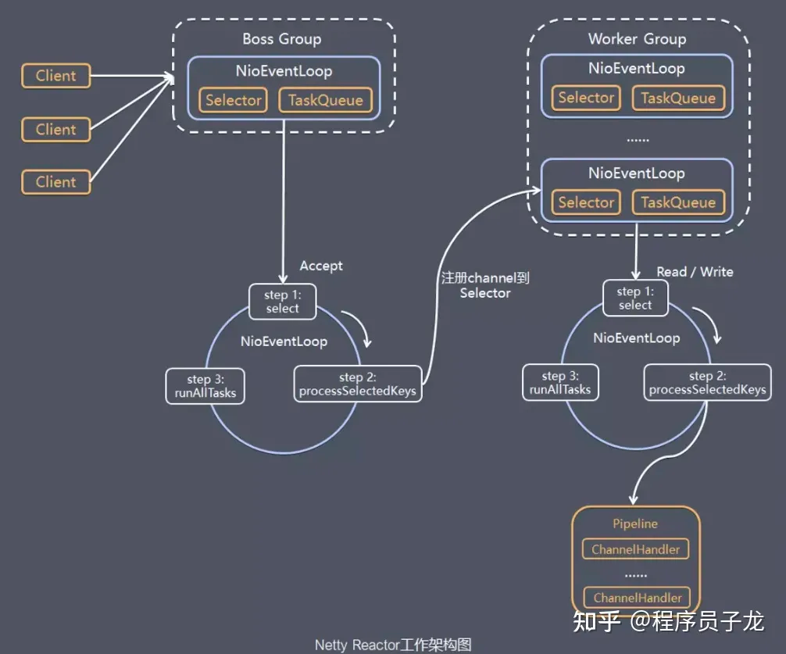
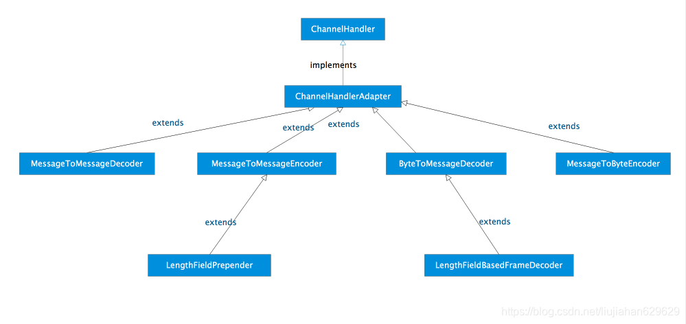
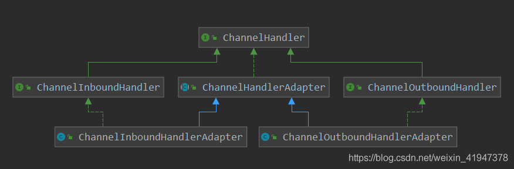
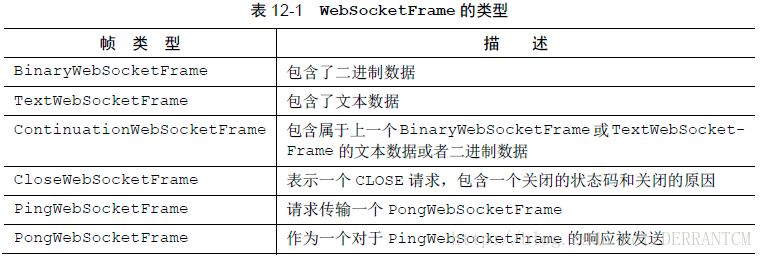

# NETTY


# Netty3 和Netty4区别
- 架构设计：Netty3采用的是Reactor模式，Netty4则增加了EventLoop和Promise等概念，进一步提升了框架的灵活性和可扩展性。
- API设计：Netty4相比Netty3的API更加简洁，并且提供了更多的可扩展接口，方便开发者进行二次开发和定制化。
- 性能表现：Netty4相比Netty3在性能方面有所提升，例如在高并发场景下的性能表现更优。
- 支持的协议：Netty4相比Netty3增加了对HTTP2和WebSocket的支持，而Netty3则不支持这些协议。

## Reactor模式
- 处理请求的两种模式
  -- thread-based architecture（基于线程）
  -- event-driven architecture（事件驱动）
- reactor设计模式是event-driven architecture的一种实现方式
  -- 处理多个客户端并发的向服务端请求服务的场景。每种服务在服务端可能由多个方法组成。
  -- reactor会解耦并发请求的服务并分发给对应的事件处理器来处理。目前，许多流行的开源框架都用到了reactor模式，如：netty、node.js等，包括java的nio。
## 根据Reactor的数量和1处理资源的线程数不同，又分3种线程模型：
- Reactor单线程
- Reactor多线程 
- 主从Reactor多线程
- Netty 的线程模型并不是一成不变的，它实际取决于用户的启动参数配置。通过设置不同的启动参数，Netty 可以同时支持 Reactor 单线程模型、多线程模型和主从 Reactor 多线程模型。
## 仔细分析一下我们需要的线程，其实主要包括以下几种：
- 事件分发器，单线程选择就绪的事件。
- I/O处理器，包括connect、read、write等，这种纯CPU操作，一般开启CPU核心个线程就可以。
- 业务线程，在处理完I/O后，业务一般还会有自己的业务逻辑，有的还会有其他的阻塞I/O，如DB操作，RPC等。只要有阻塞，就需要单独的线程。

## 事件分发器（event dispatcher）
- 一般情况下，I/O 复用机制需要事件分发器（event dispatcher）。
- 事件分发器的作用，即将那些读写事件源分发给各读写事件的处理者，就像送快递的在楼下喊: 谁谁谁的快递到了， 快来拿吧！
- 开发人员在开始的时候需要在分发器那里注册感兴趣的事件，并提供相应的处理者（event handler)，或者是回调函数；
- 事件分发器在适当的时候，会将请求的事件分发给这些handler或者回调函数。
- 涉及到事件分发器的两种模式称为：Reactor和Proactor
- Reactor模式是基于同步I/O的，而Proactor模式是和异步I/O相关的。
## Reactor中的事件分发器
- 在Reactor模式中，事件分发器等待某个事件或者可应用或个操作的状态发生（比如文件描述符可读写，或者是socket可读写）
- ，事件分发器就把这个事件传给事先注册的事件处理函数或者回调函数，由后者来做实际的读写操作。
## 在Reactor中实现读
- 注册读就绪事件和相应的事件处理器。
- 事件分发器等待事件。
- 事件到来，激活分发器，分发器调用事件对应的处理器。
- 事件处理器完成实际的读操作，处理读到的数据，注册新的事件，然后返还控制权

## Proactor
- 而在Proactor模式中，事件处理者（或者代由事件分发器发起）直接发起一个异步读写操作（相当于请求）
- ，而实际的工作是由操作系统来完成的。发起时，需要提供的参数包括用于存放读到数据的缓存区、读的数据大小或用于存放外发数据的缓存区
- ，以及这个请求完后的回调函数等信息。事件分发器得知了这个请求，它默默等待这个请求的完成，然后转发完成事件给相应的事件处理者或者回调。
- 举例来说，在Windows上事件处理者投递了一个异步IO操作（称为overlapped技术），事件分发器等IO Complete事件完成。
- 这种异步模式的典型实现是基于操作系统底层异步API的，所以我们可称之为“系统级别”的或者“真正意义上”的异步，因为具体的读写是由操作系统代劳的。
## 在Proactor中实现读
- 处理器发起异步读操作（注意：操作系统必须支持异步IO）。在这种情况下，处理器无视IO就绪事件，它关注的是完成事件。
- 事件分发器等待操作完成事件。
- 在分发器等待过程中，操作系统利用并行的内核线程执行实际的读操作，并将结果数据存入用户自定义缓冲区，最后通知事件分发器读操作完成。
- 事件分发器呼唤处理器。
- 事件处理器处理用户自定义缓冲区中的数据，然后启动一个新的异步操作，并将控制权返回事件分发器。

# 线程池
- Netty有两组线程池，一个Boss Group，它专门负责客户端连接，另一个Work Group，专门负责网络读写；
## Boss Group
- (1). 轮询accept连接事件；
- (2). 处理accept事件，与client建立连接，生成一个NioSocketChannel，并将其注册到某个work group下的NioEventLoop的selector上；
- (3). 处理任务队列的任务，即runAllTasks；
## Work Group
- (1). 轮询read、write事件；
- (2). 处理read、write事件，在对应的NioSocketChannel处理；
- (3). 处理任务队列的任务，即runAllTasks；
## ServerBootstrap
- 主要作用是配置整个 Netty 程序，串联各个组件，Netty 中 Bootstrap 类是客户端程序的启动引导类，ServerBootstrap 是服务端启动引导类。
-- 

# NioEventLoop
- Boss Group & Work Group 都实现了NIOEventLoopGroup
- 每个EventLoop中维护一个Selector实例
- NioEventLoop 中维护了一个线程和任务队列，支持异步提交执行任务
  ，线程启动时会调用 NioEventLoop 的 run 方法，执行 I/O 任务和非 I/O 任务：
  - I/O 任务，即 selectionKey 中 ready 的事件，如 accept、connect、read、write 等，由 processSelectedKeys 方法触发。
  - 非 IO 任务，添加到 taskQueue 中的任务，如 register0、bind0 等任务，由 runAllTasks 方法触发。

# NioEventLoopGroup
- 主要管理 eventLoop 的生命周期，可以理解为一个线程池，内部维护了一组线程
  ，每个线程(NioEventLoop)负责处理多个 Channel 上的事件，而一个 Channel 只对应于一个线程。

# ChannelGroup
- ChannelGroup是一个线程安全的集合，它提供了打开一个Channel和不同批量的方法。可以使用ChannelGroup来讲Channel分类到一个有特别意义的组中。
- 当组中的channel关闭时会自动从组中移除，因此我们不需要担心添加进去的channel的生命周期。一个channel可以属于多个ChannelGroup。

# Channel
- Channel是Netty最核心的接口，一个Channel就是一个联络Socket的通道，通过Channel，你可以对Socket进行各种操作。

# ChannelHandler

- 【新建】handlerAdded
- 【退出】handlerRemoved
- 【异常处理】exceptionCaught

# ChannelPipeline
- ChannelPipeline实际上应该叫做ChannelHandlerPipeline，可以把ChannelPipeline看成是一个ChandlerHandler的链表
- ，当需要对Channel进行某种处理的时候，Pipeline负责依次调用每一个Handler进行处理。每个Channel都有一个属于自己的Pipeline
- ，调用Channel#pipeline()方法可以获得Channel的Pipeline，调用Pipeline#channel()方法可以获得Pipeline的Channel。

# ChannelInboundHandler & ChannelOutboundHandler

- extends ChannelHandler
- ChannelInboundHandler 包含的都是一些被动调用的方法，数据流向是从外面传进来的
  例如channelRead，外面传数据来了，管道有数据了就会触发；channelActive，外面请求连接，管道被激活了就会触发…
- ChannelOutboundHandler 包含的都是一些主动调用的方法，数据流向是从内向外发的
  例如bind，绑定端口；connect，连接；disconnect，断开连接；close关闭通道；write写数据…

# ChannelHandlerContext
- 不管是ChannelHandler还是ChannelOutboundHandler和ChannelInboundHandler，几乎他们中所有的方法都带有一个ChannelHandlerContext
- 首先ChannelHandlerContext是一个AttributeMap，可以用来存储多个数据。
- 然后ChannelHandlerContext继承了ChannelInboundInvoker和ChannelOutboundInvoker,可以触发inbound和outbound的一些方法。
- 除了继承来的一些方法之外，ChannelHandlerContext还可以作为channel，handler和pipline的沟通桥梁，因为可以从ChannelHandlerContext中获取到对应的channel，handler和pipline

# IdleStateHandler
- 心跳

# ByteBufAllocator
- 内存分配有最顶层的抽象类，负责分配所有ByteBuf 类型的内存。

# 粘包或半包现象
- 即使我们发送消息的时候是以 ByteBuf 的形式发送的，但是到了底层操作系统
- ，仍然是以字节流的形式对数据进行发送的，而且服务端也以字节流的形式读取
- ，因此在服务端对字节流进行拼接时，可能就会造成发送时
- ByteBuf 与读取时的 ByteBuf 不对等的情况，这就是所谓的粘包或半包现象。

# websocket  
## WebSocketServerProtocolHandler

- 由IETF 发布的WebSocket RFC，定义了6 种帧，Netty 为它们每种都提供了一个POJO 实现。表12-1 列出了这些帧类型，并描述了它们的用法。
- TextWebSocketFrame 是我们唯一真正需要处理的帧类型。为了符合WebSocket RFC，Netty 提供了WebSocketServerProtocolHandler 来处理其他类型的帧。
## nginx.conf中的配置
```
#第一步：
upstream websocket-router {
        server 192.168.1.31:7000 max_fails=10 weight=1 fail_timeout=5s;
        keepalive 1000;
}
#第二步：
server {
        listen      80; #监听80端口
        server_name websocket.wdy.com; #域名配置

        ssl_session_cache    shared:SSL:1m;
        ssl_session_timeout  5m;

        ssl_ciphers  HIGH:!aNULL:!MD5;
        ssl_prefer_server_ciphers  on;

        location / {
            client_max_body_size 100M;
            proxy_http_version 1.1;
            proxy_set_header Host $host;
            proxy_set_header Upgrade $http_upgrade; #支持wss
            proxy_set_header Connection "upgrade"; #支持wssi
            proxy_pass http://websocket-router; #代理路由
            root   html;
            index  index.html index.htm;
        }
    }
```


# 聊天室（im & chatroom）
## 读扩散-拉模式
- 【写入】读扩散拉取，对写非常友好：A用户发送消息只需要写在A用户消息列表
- 【读取】读扩散拉取，对读操作却非常复杂，群中用户B先要看到A已经其他用户的所有消息，需要把该群所有用户拿出来遍历查询，并且排序
## 写扩散-推模式
- 【写入】相反写扩散推送，对写来说非常复杂，A用户发送消息，需要知道A用户所在的群集合，在所有群中写入A新发的消息；当用户退群时候需要清理该群用户发送的消息；
- 【读取】B用户所在群消息 拉取时候，直接从该群消息记录表拉取即可
