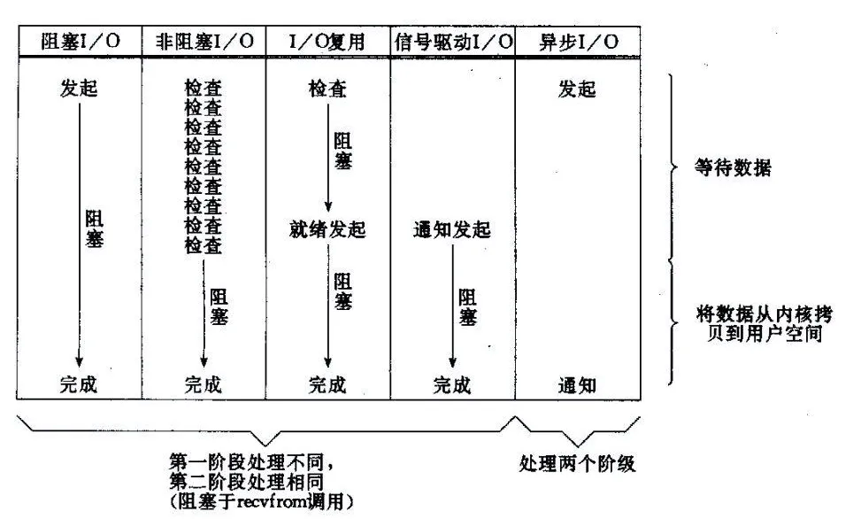

# IO
- 【定义】IO就是链接，IO在计算机中指Input/Output，也就是输入和输出。由于程序和运行时数据是在内存中驻留
- ，由CPU这个超快的计算核心来执行，涉及到数据交换的地方，通常是磁盘、网络等，就需要IO接口。
- 【I/O操作】I/O操作是相对于内存而言的，从外部设备进入内存就叫Input,反之从内存输出到外部设备就叫Output。
- 【LINUX】LINUX中进程无法直接操作I/O设备，必须通过系统调用，请求kernel来协助完成I/O动作。内核会为每个I/O设备维护一个缓冲区。
- 【IO类型】通常用户进程中的一个完整IO分为两阶段：用户进程空间<-->内核空间、内核空间<- ->设备空间(磁盘、网络等)。IO有内存IO、 网络IO和磁盘IO三种，通常我们说的IO指的是后两者。

## IO复用
- Linux中IO复用的实现方式主要有Select，Poll和Epoll：
-【Select】注册IO、阻塞扫描，监听的IO最大连接数不能多于FD_ SIZE（1024）。
-【Poll】原理和Select相似，没有数量限制，但IO数量大，扫描线性性能下降。
-【Epoll】事件驱动不阻塞，mmap实现内核与用户空间的消息传递，数量很大，Linux2.6后内核支持。
- select/epoll本质上也是阻塞式IO，只不过他们可以同时监控多个Socket。
- 为什么多路复用IO模型有两个系统API？我分析原因是，select是POSIX标准中定义的，但是性能不够好，所以各个操作系统都推出了性能更好的API，如Linux上的epoll、Windows上的IOCP。
- 至于select为什么会慢，大家比较认可的原因有两点，一点是select方法返回后，需要遍历所有监控的Socket，而不是发生变化的Ssocket，还有一点是每次调用select方法，都需要在用户态和内核态拷贝文件描述符的位图（通过调用三次copy_from_user方法拷贝读、写、异常三个位图）。epoll可以避免上面提到的这两点。
- 在Linux操作系统上，性能最为可靠、稳定的IO模式就是多路复用，我们的应用如何能够利用好多路复用IO呢？经过前人多年实践总结，搞了一个Reactor模式，目前应用非常广泛，著名的Netty、Tomcat NIO就是基于这个模式。

## IO模型

- 【阻塞IO模型/BIO】进程发起IO系统调用后，进程被阻塞，转到内核空间处理，整个IO处理完毕后返回进程，操作成功则进程获取到数据。
-- 同步阻塞
- 【非阻塞IO模型/NIO】和上面的阻塞IO模型相比，非阻塞IO模型在内核数据没准备好，需要进程阻塞的时候，就返回一个错误，以使得进程不被阻塞。
-- 非阻塞只是解决了 用户写入，服务端去读取写入需要等待的问题（未写入完成会报错），但是这里会同步非阻塞
- 【IO复用模型/NIO多路复用】多个的进程的IO可以注册到一个复用器(select)上，然后用一个进程调用该select,，select会监听所有注册进来的IO。
-- IO复用的目的是为了解决，非阻塞IO后，造成同时多个写入并发完成后，需要开辟多个线程去监听不同的写入完成问题
-- 多路复用就是为了解决由一个线程监控多个网络请求（我们后面将称为fd文件描述符，linux系统把所有网络请求以一个fd来标识）
- 【信号驱动的IO模型】当进程发起一个IO操作，会向内核注册一个信号处理函数，然后进程返回不阻塞；当内核数据就绪时会发送一个信号给进程，进程便在信号处理函数中调用IO读取数据。
-- 复用IO模型解决了一个线程可以监控多个fd的问题，但是select是采用轮询的方式来监控多个fd的，通过不断的轮询fd的可读状态来知道是否有可读的数据
- ，而无脑的轮询就显得有点暴力，因为大部分情况下的轮询都是无效的，所以有人就想，能不能不要我总是去问你是否数据准备就绪
- ，能不能我发出请求后等你数据准备好了就通知我，所以就衍生了信号驱动IO模型。
- 【异步IO模型/AIO】当进程发起一个IO操作，进程返回(不阻塞)，但也不能返回结果。内核把整个IO处理完后，会通知进程结果，如果IO操作成功则进程直接获取到数据。
-- 也许你一开始就有一个疑问，为什么我们明明是想读取数据，而却非得要先发起一个select询问数据状态的请求
- ，然后再发起真正的读取数据请求,能不能有一种一劳永逸的方式，我只要发送一个请求我告诉内核我要读取数据
- ，然后我就什么都不管了，然后内核去帮我去完成剩下的所有事情？

# 同步异步 & 阻塞非阻塞
-老张爱喝茶，废话不说，煮开水。 出场人物：老张，水壶两把（普通水壶，简称水壶；会响的水壶，简称响水壶）。
-- 老张把水壶放到火上，立等水开。（同步阻塞）老张觉得自己有点傻
-- 老张把水壶放到火上，去客厅看电视，时不时去厨房看看水开没有。（同步非阻塞）
-- 老张把响水壶放到火上，立等水开。（异步阻塞）老张觉得这样傻等意义不大
-- 张把响水壶放到火上，去客厅看电视，水壶响之前不再去看它了，响了再去拿壶。（异步非阻塞）老张觉得自己聪明了。
## 同步异步
- 同步异步指的是，当数据已经ready的时候，读写操作是同步读还是异步读，阶段不同而已。
- 【同步请求】A调用B，B的处理是同步的，在处理完之前他不会通知A，只有处理完之后才会明确的通知A。
- 【异步请求】A调用B，B的处理是异步的，B在接到请求后先告诉A我已经接到请求了，然后异步去处理，处理完之后通过回调等方式再通知A。
## 阻塞非阻塞
- 阻塞与非阻塞指的的是当不能进行读写（网卡满时的写/网卡空的时候的读）的时候，I/O 操作立即返回还是阻塞
- 【阻塞请求】A调用B，A一直等着B的返回，别的事情什么也不干。
- 【非阻塞请求】A调用B，A不用一直等着B的返回，先去忙别的事情了。

# SOCKET
- 【一切源自网卡】高并发的流量通过低调的路由器进入我们系统，第一道关卡就是网卡，网卡怎么抗住高并发？这个问题压根就不存在，千万并发在网卡看来
- 网卡和磁盘一样，内部也是有缓存的，网卡接收网络数据，先存放到网卡缓存，然后写入操作系统的内核空间（内存），我们的应用程序则读取内存中的数据，然后处理。
- 如果网卡的缓存太小，当缓存满了后，网卡会直接把新接收的数据丢掉，造成丢包。
- ，一样一样的，都是电信号，网卡眼里根本区分不出来你是千万并发还是一股洪流，所以衡量网卡牛不牛都说带宽，从来没有并发量的说法。
- 【Socket】IO就是链接，而Socket是面向连接的，IP层没有连接的概念，在IP层，来一个数据包就处理一个，不用瞻前也不用顾后；
- 应用层一切都源于Socket，那些千万并发最终会经过传输层变成千万个Socket，Socket是面向连接的，有上下文的，读到一句我爱你，激动半天，你不前前后后地看看，就是瞎激动了。
- 【】